# Remote Play user manual

Remote Play is a web gateway for **Axia Livewire** and **AES67** audio-over-IP.
It listens to what is advertising on the broadcast LAN, presents every source
in one browser console, and transcodes any of them to Opus so an operator can
monitor them from a laptop, a phone, or a wall-mounted panel — without a
hardware receiver and without joining the multicast groups themselves.

This manual covers the operator and administrator console. It is written
against the shipping build; every label in **bold** is quoted verbatim from the
UI.

> **This revision is not yet complete.** It covers signing in, the Sources
> console, source lists, monitoring panels, audio outputs, Remote Talk, server
> settings and licensing. Device management, federation and the REST surface
> are named where they appear but not yet documented in full — see
> [What this revision does not cover](#what-this-revision-does-not-cover).

## Contents

1. [Core concepts](#1-core-concepts)
2. [Getting started](#2-getting-started)
   — [running with Docker](#running-with-docker), [running on Linux](#running-on-linux), [running on Windows](#running-on-windows), [first sign-in](#first-sign-in)
3. [Sources](#3-sources)
4. [Source lists](#4-source-lists)
   — [the list editor](#the-list-editor), [parent nodes](#parent-nodes), [renaming an entry](#renaming-an-entry)
5. [Monitoring panels](#5-monitoring-panels)
   — [assigning sources](#assigning-sources), [pad labels and lamp colours](#pad-labels-and-lamp-colours), [panel settings](#panel-settings), [visibility](#visibility-personal-private-and-public), [the kiosk view](#the-kiosk-view)
6. [Audio outputs](#6-audio-outputs)
   — [configuring an AES67 output](#configuring-an-aes67-output), [routing sources](#routing-sources-to-outputs)
7. [Server administration](#7-server-administration)
   — [Groups](#groups), [General](#general), [TLS](#tls), [Email](#email), [Backups](#backups)
8. [Licence](#8-licence)
9. [Remote Talk](#9-remote-talk)
   — [the mental model](#the-mental-model), [concepts](#concepts), [stations](#stations), [productions and teams](#productions-and-teams), [channels: the four kinds](#channels-the-four-kinds), [panel profiles](#panel-profiles), [walking through a talk plan](#walking-through-a-talk-plan), [Panel Builder](#panel-builder), [wall panels](#wall-panels), [Plan Sync](#plan-sync-authority-and-subscriber), [the /talk client](#the-talk-client), [panels and kiosk displays](#panels-and-kiosk-displays), [recording a channel](#recording-a-channel), [Talk Status diagnostics](#talk-status-diagnostics), [the fleet](#the-fleet-instances-homing-and-the-portal), [licensing](#licensing), [known issues](#known-issues-in-this-build), [troubleshooting](#troubleshooting)
10. [Example configurations](#10-example-configurations)
    — [sports broadcast](#sports-broadcast--a-single-ob-truck), [ballet](#ballet--a-lyric-theatre), [Olympics](#olympics--multi-venue-one-broadcast-centre), [a parade](#a-parade--a-moving-route)
11. [What this revision does not cover](#what-this-revision-does-not-cover)

---

## 1. Core concepts

**Sources are discovered, not configured.** Remote Play joins the Livewire
advertisement group (239.192.255.3:4001) and the SAP groups AES67 senders
announce on (224.2.127.254 and 239.255.255.255, both port 9875). Everything
advertising on the network it can see appears in the console within a few
seconds. Nothing is typed in by hand unless a source does not advertise at all,
in which case it can be added manually from an SDP or a multicast address.

**A source keeps its identity across restarts.** Every source has a stable key
of the form `origin:type:channel` — origin is `local` for something this server
discovered itself, `manual` for a hand-added source, or the id of a legacy
RemotePlay server it was aggregated from; type is `lwto`, `lwfrom`, `aes67` or
`soundcard`. Lists and panels store that key and re-resolve it against live
inventory, so a source that goes off air and comes back returns to the same
list entry and the same panel pad rather than becoming a new one.

**Two roles, not four.** Every account is either **admin** or **user**. Admins
see the whole console, including the **Admin** and **Settings** groups in the
sidebar. Users see **Sources**, **Panel** and **Source Lists**, and their own
saved panel layouts. Older installations that carried operator or viewer roles
coerce them to user on upgrade.

**Monitoring is Opus over WebSocket.** Pressing **Play** on a source opens a
WebSocket to the server, which joins the multicast group on the operator's
behalf, buffers the RTP, and encodes to Opus at the bitrate chosen in the
player. The operator's browser never touches the AoIP network.

## 2. Getting started

### Requirements

| | |
|---|---|
| Server OS | Linux or Windows, .NET 8 runtime |
| Network | An interface on the broadcast LAN, able to join multicast groups. On a multi-homed host, name it with `--Livewire:BindAddress=<ip>`. |
| Browser | Any current Chromium, Firefox or Safari. Opus playback needs no plugin. |
| Audio outputs (optional) | For an **ALSA** (soundcard) output: GStreamer 1.20 or later on a Linux server. **AES67** outputs are built in and need nothing extra — but see the note on PTP ports 319/320 under each platform below. |

### Running with Docker

The published image is **`cloudcastsystems/remoteplaycore`** on Docker Hub —
`latest` tracks the current release, and each release also carries a version
tag. This is the recommended way to run Remote Play on a server.

```bash
docker run -d --name remoteplay \
  --network host \
  --restart unless-stopped \
  -v remoteplay-data:/var/lib/remoteplaycore \
  cloudcastsystems/remoteplaycore:latest
```

The console is then at `http://<host>:8080`.

**`--network host` is not optional on a broadcast LAN.** Livewire and AES67
discovery, the RTP audio itself, and the PTP clock (UDP 319/320, used by AES67
outputs) are all multicast or low-port traffic that does not traverse Docker's
default bridge network. A bridged container (`-p 8080:8080` instead of
`--network host`) starts fine and serves the console, but discovers nothing —
that mode is only useful for a cloud or off-LAN host acting as a federation
front for on-prem servers, or one carrying manually-added sources.

Everything mutable — the LiteDB database, the auth signing key, an uploaded TLS
certificate — lives in `/var/lib/remoteplaycore`, which the command above keeps
in the named volume `remoteplay-data`. Upgrades are therefore stateless:

```bash
docker pull cloudcastsystems/remoteplaycore:latest
docker rm -f remoteplay
# then the same docker run command as above
```

Two environment variables shape the container: `WEBPORT` (default `8080`)
moves the HTTP console port — with host networking the container binds it
directly — and `DATADIR` moves the state directory. Any arguments after the
image name are passed to the server as configuration, so on a multi-homed host
the audio NIC is selected the same way as everywhere else:

```bash
docker run -d --name remoteplay --network host \
  -v remoteplay-data:/var/lib/remoteplaycore \
  cloudcastsystems/remoteplaycore:latest --Livewire:BindAddress=192.168.2.10
```

The image carries a health check (it polls the API every 30 s), so `docker ps`
shows the container as **healthy** once the server is actually answering.

### Running on Linux

There is no packaged Linux installer yet; a bare-metal install is built from
source (repository access required). Two prerequisites: the **.NET 8 SDK** and
**Node.js 18+** (the Node toolchain builds the web console; it is not needed at
runtime).

```bash
./build/build-web.sh                     # build the SPA into the server's wwwroot
dotnet publish src/RemotePlayCore.Control -c Release -r linux-x64 \
  --self-contained -o /opt/remoteplay    # self-contained: no .NET runtime needed on the host
sudo mkdir -p /var/lib/remoteplay
/opt/remoteplay/RemotePlayCore.Control --DataDir=/var/lib/remoteplay
```

`--DataDir` anchors the database, signing key and TLS certificate; without it
they land in whatever directory the server was started from. The console is at
`http://<host>:8080` (`--Http:Port=<n>` to move it).

To run it as a service, a minimal systemd unit:

```ini
[Unit]
Description=Remote Play
After=network-online.target
Wants=network-online.target

[Service]
User=remoteplay
ExecStart=/opt/remoteplay/RemotePlayCore.Control --DataDir=/var/lib/remoteplay
WorkingDirectory=/opt/remoteplay
Restart=always
AmbientCapabilities=CAP_NET_BIND_SERVICE

[Install]
WantedBy=multi-user.target
```

`AmbientCapabilities=CAP_NET_BIND_SERVICE` matters if AES67 **outputs** will be
used: the built-in PTP slave listens on UDP ports 319 and 320, which a non-root
process cannot bind by default. Without the capability the output still runs —
it free-runs on the system clock and the **Audio Outputs** page says why — but
it will never lock to the plant's PTP grandmaster. Discovery and browser
monitoring need no special privileges.

For an **ALSA** soundcard output, install the GStreamer runtime
(`libgstreamer1.0-0 gstreamer1.0-plugins-base gstreamer1.0-plugins-good
gstreamer1.0-plugins-bad` on Debian/Ubuntu). AES67 outputs do not use
GStreamer.

### Running on Windows

Windows runs the full console and is the normal development platform; it is
also built from source with the **.NET 8 SDK** and **Node.js 18+** (run
`./build/build-web.sh` from Git Bash, or `npm install && npm run build` in
`web/RemotePlayCore.Web` and copy `dist` to
`src/RemotePlayCore.Control/wwwroot`):

```powershell
dotnet run --project src/RemotePlayCore.Control -- --DataDir=C:\ProgramData\RemotePlay
```

or publish a self-contained build the same way as on Linux with `-r win-x64`
and run `RemotePlayCore.Control.exe` from the output directory. When Windows
Defender Firewall asks on first start, **allow access on private networks** —
discovery and the RTP audio arrive as inbound multicast UDP, so a blocked
profile means an empty Sources tree on an otherwise healthy network. On a
multi-homed machine set `--Livewire:BindAddress` to the AoIP NIC, exactly as on
Linux.

Two Windows-specific caveats:

- There is no Windows service wrapper yet — run it in a console session, or
  from Task Scheduler as an at-startup task.
- AES67 **outputs** transmit correctly from Windows, but Windows timer
  granularity and best-effort DSCP marking make it a development-grade sender.
  For an on-air AES67 output, prefer the Docker image or a Linux host. The
  **ASIO** output kind is visible in the console but not yet implemented — an
  ASIO output reports **error** on start.

### First sign-in

A fresh installation with no user accounts creates a bootstrap administrator
and logs a warning saying so. Sign in with **admin** / **admin**.

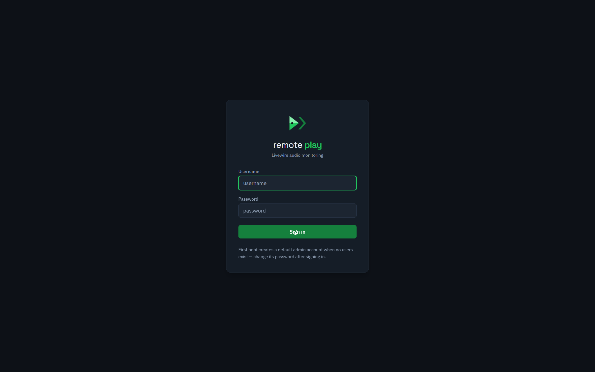

The sign-in page states this directly: *"First boot creates a default admin
account when no users exist — change its password after signing in."* Do that
immediately — **Password** at the bottom of the sidebar. If the server is
configured for LDAP or an OIDC provider, directory accounts sign in through the
same two fields, and any configured SSO provider appears as its own
**Sign in with …** button.

### The console at a glance

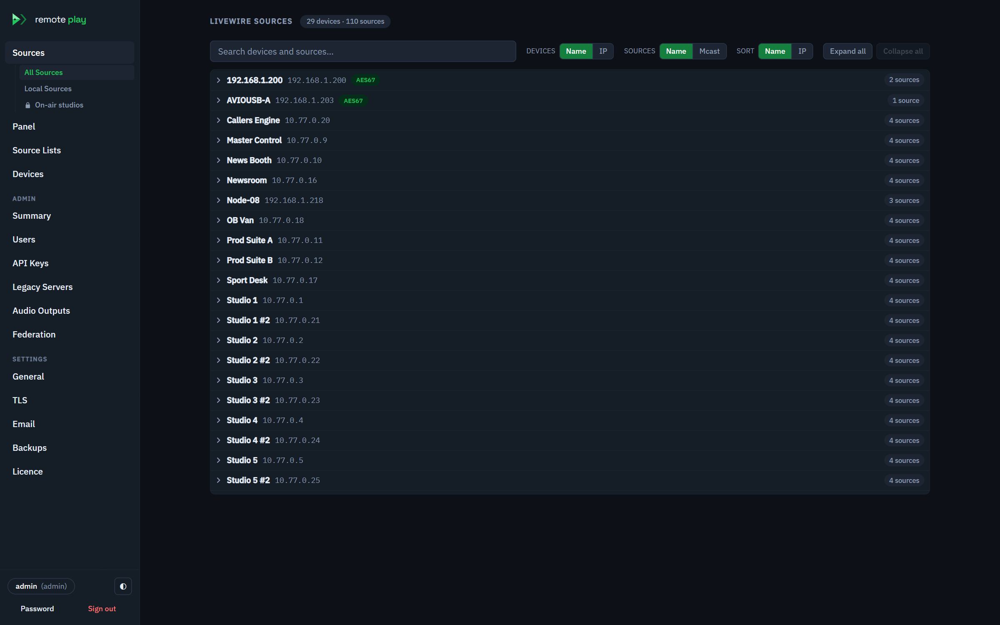

The sidebar is the whole navigation model. The Remote Play mark at the top is
the home affordance — clicking it returns to **Sources**. Below it:

| Group | Entries |
|---|---|
| *(top level)* | **Sources** (with **All Sources**, **Local Sources** and one entry per source list), **Panel**, **Talk**, **Source Lists**, **Devices** |
| **Admin** | **Summary**, **Talk Status**, **Talk Plan**, **Users**, **Groups**, **API Keys**, **Legacy Servers**, **Audio Outputs**, **Federation** |
| **Settings** | **General**, **Network**, **TLS**, **Email**, **Backups**, **Licence** |

The **Admin** and **Settings** groups are admin-only. At the bottom sit the
signed-in account, a light/dark toggle, and **Password** / **Sign out**.

## 3. Sources

**Sources** is the console's home page: every device the server can see,
grouped by device, with each device's source count on the right. The header
counts what has been found, and a device row expands to its sources.

Each source row carries its channel number, name and multicast address, a
protocol badge — **LW** for Livewire, **AES67** for an AES67 stream — and a
**Play** button. Device rows carry the badge too, so a plant running both
protocols can be read at a glance.

### Finding a source

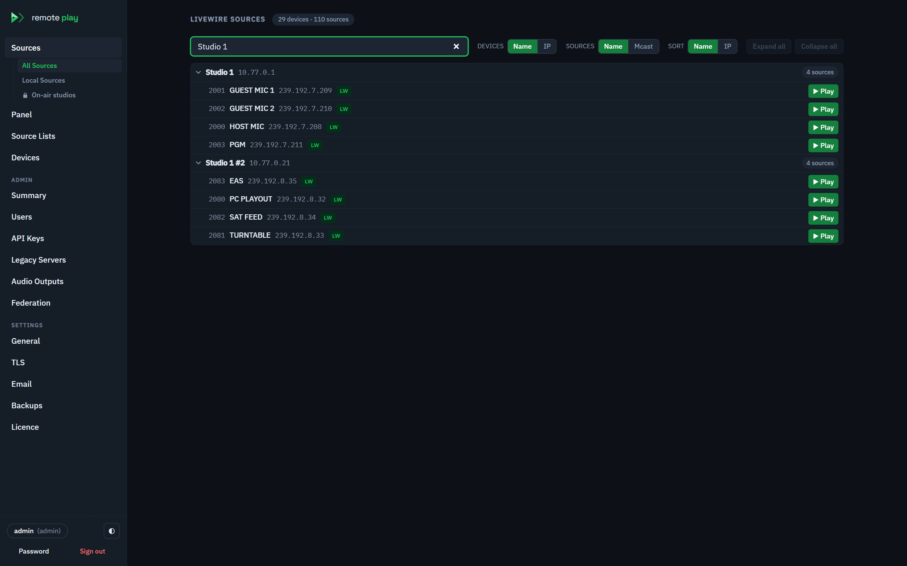

**Search devices and sources…** filters the tree as you type, matching both
device and source names — above, `Studio 1` has narrowed a plant of a hundred
sources to two devices. Three toggles control how the tree is laid out:

| Toggle | Options | Effect |
|---|---|---|
| **DEVICES** | **Name** / **IP** | Label device rows by name or by IP address |
| **SOURCES** | **Name** / **Mcast** | Label source rows by name or by multicast group |
| **SORT** | **Name** / **IP** | Order the tree alphabetically or by address |

**Expand all** and **Collapse all** act on the whole tree. On a plant with
thousands of sources, collapse first and search — the tree is built for that
scale.

### The source filters

Under **Sources** in the sidebar:

- **All Sources** — everything, including sources aggregated from federated
  peers and legacy RemotePlay servers.
- **Local Sources** — only what this server discovered itself.
- **One entry per source list** — see [§4](#4-source-lists). Lists you can see
  but not edit carry a padlock.

### Listening

**Play** on a source row starts monitoring it; **Stop** ends it. The player
carries a level meter and a bitrate selector. Some rows cannot be played and
say why:

| State | Meaning |
|---|---|
| **locked** | *"Source is locked on the device"* — the device itself will not release it. |
| **remote** | The source belongs to a federated peer; *"streams via origin server"*. |
| *manual* | *"Manual sources can't be monitored from this page yet."* |

## 4. Source lists

A source list is a curated set of sources — a studio's regular feeds, an
engineer's fault-finding set, the sources a particular panel draws from. Lists
appear as their own entries under **Sources**, so choosing one filters the tree
to its members.

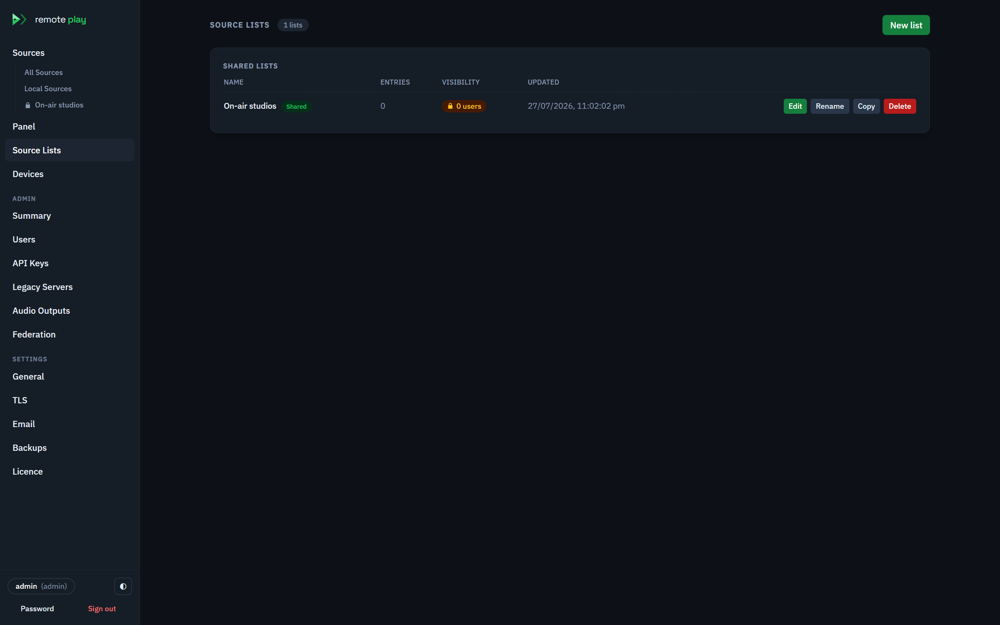

The page separates **My lists** from **Shared lists**; a shared list you do not
own is marked **Shared** and **read-only**. The table shows **Name**,
**Entries**, **Visibility** and **Updated**. Visibility is either **All users**
or an explicit set (**1 user** / **{n} users**).

**New list** creates one, and **View** opens the editor.

### The list editor

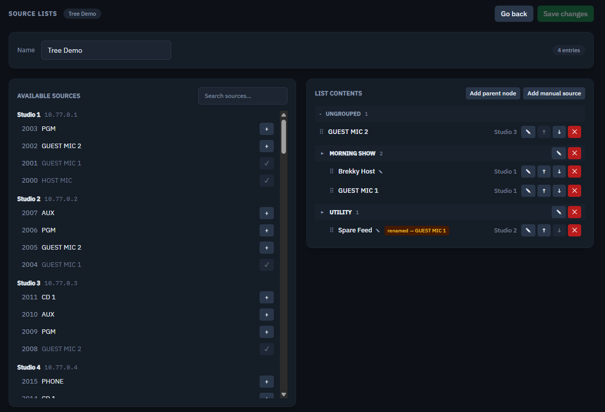

The editor is two panes. **Available sources** on the left is the live
inventory, grouped by device with a **Search sources…** box; **List contents**
on the right is the list being built. A source row's **+** adds it (*"Add to
list"*); one already used shows a tick instead (*"Already in the list"*). Rows
can also be dragged across — *"Drag sources here, or use a row's + button."*

The list name and its entry count sit above both panes, and edits are staged
until **Save changes** — an **Unsaved changes** marker appears meanwhile, and
leaving asks *"Discard unsaved changes?"*. **Go back** returns to the list
index.

#### Parent nodes

**Add parent node** creates a named group inside the list — *Morning Show* and
*Utility* in the capture above. Entries that belong to no group collect under
**Ungrouped**, and each node shows how many entries it holds. A node can be
renamed, and removing one is not destructive: *"Remove parent node (entries
stay, ungrouped)"*. An empty node prompts *"Drag sources onto this node."*

Parent nodes are how a long list stays readable — a studio's list can separate
the show feeds from the utility ones without needing two lists.

#### Renaming an entry

The pencil on any entry sets a **display name** for that entry only; the
underlying source is untouched, and the same source in another list keeps its
own name. A renamed entry carries a **renamed → {original}** badge, so nobody
has to guess what *Brekky Host* or *Spare Feed* actually points at. The device
each entry came from is shown on the right of its row.

This is the answer to terse plant labels: the console can say *Brekky Host*
where the device advertises *GUEST MIC 1*.

#### Ordering and removal

Each entry has a drag handle plus **Move up** / **Move down** arrows, and the
red **×** is **Remove from list**. Order is the list's own — it is what the
Sources tree and the panel drawer show when filtered to that list.

#### Sources that are not on air

Because entries are stored by their stable `origin:type:channel` key, a list
keeps working across restarts and re-advertisements. An entry with no live
match is marked **missing** rather than dropped: *"No live source matches this
entry — it is kept but unplayable."* Filtering the Sources tree to a list whose
entries are all off air says so plainly: *"None of this list's entries match a
live source right now."*

A source that never advertises at all can still be listed. **Add manual
source** takes it directly — by Livewire channel, AES67 multicast address or
soundcard — and the **add by SDP or multicast address** flow parses a pasted
SDP blob or an address and port, storing the result as a `manual` source.

#### Who can see a list

A list is visible to every signed-in user (*"Every signed-in user sees this
list."*) or restricted to named accounts and groups: **Allowed users** and
**Allowed groups**, where *"Only the ticked users and groups (plus admins) see
this list."* With no groups defined the picker says *"No groups defined —
create them under Admin › Groups."* See [Groups](#groups).

## 5. Monitoring panels

A panel is a rack-unit-styled grid of pads. Each pad is bound to a source;
pressing it monitors that source, and — on an admin-configured room panel —
routes it to the panel's audio output.

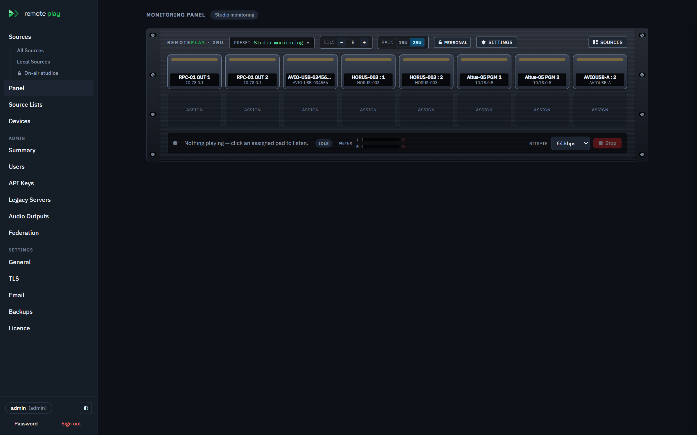

The panel toolbar carries, left to right: the panel name and **PRESET**
selector, **COLS** with − / + to set the pad columns, a **RACK** toggle between
**1RU** and **2RU**, the visibility chip (**PERSONAL**), **SETTINGS**, and
**SOURCES** — which opens the source drawer on the right.

Underneath sits the player strip: state (**IDLE** until a pad is pressed), a
stereo **METER**, a **BITRATE** selector and **Stop**. An unassigned pad reads
**ASSIGN**.

### Assigning sources

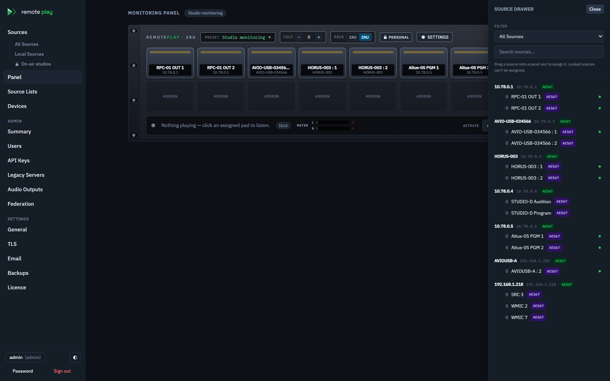

**SOURCES** opens the drawer: *"Drag a source onto a panel slot to assign it.
Locked sources can't be assigned."* The drawer has its own **Filter** (any
source list) and **Search sources…** box, and marks sources already on the
panel as *"Already on the panel"*.

Clicking an empty **ASSIGN** pad is the quicker route — it opens a picker for
that slot alone, titled **Assign source to slot {n}**:

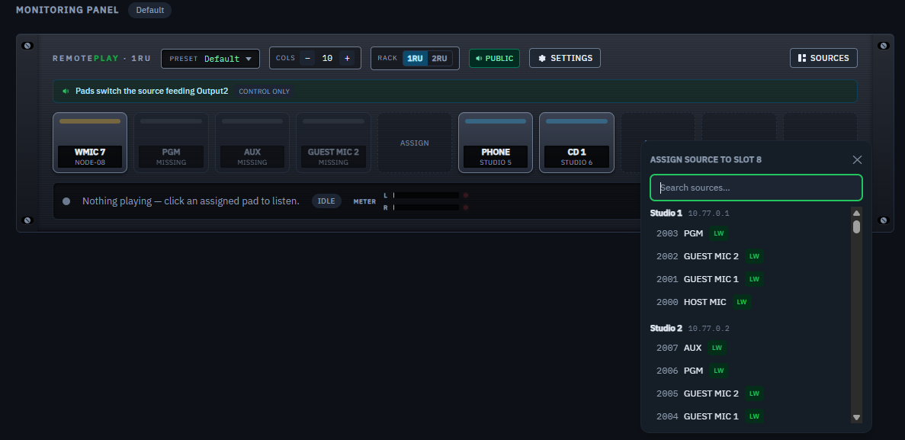

The picker is the same inventory, grouped by device with protocol badges and a
**Search sources…** box, scoped to the one slot you clicked. Choosing a source
fills the pad and closes the picker.

### Pad labels and lamp colours

Clicking a pad that already has a source opens its editor.

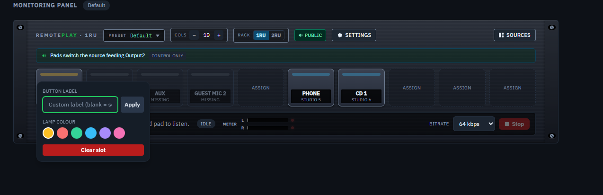

**BUTTON LABEL** overrides what the pad shows — *"Custom label (blank = source
name)"* — and takes effect on **Apply**. **LAMP COLOUR** picks the pad's lamp
from **Amber**, **Red**, **Green**, **Blue**, **Violet** or **Pink**, which is
what makes a wall panel readable from across a studio: mics on one colour,
returns on another. **Clear slot** empties the pad without touching the layout
around it.

A pad whose source has left the inventory keeps its label and shows **MISSING**
beneath it, so the layout never reshuffles when a device drops off air.

### Layouts

Panels are saved as named layouts. **Layouts** lists them, **Save as…** stores
the current arrangement under a new name, and **Manage layouts…** renames and
deletes. The active layout is marked **active**, and unsaved changes show an
**unsaved** chip beside the panel name. Layouts are per-user: yours are yours
unless an admin publishes a panel as a room panel.

### Panel settings

**SETTINGS** on the panel toolbar opens **Panel settings**, where an
administrator turns a personal layout into a room panel.

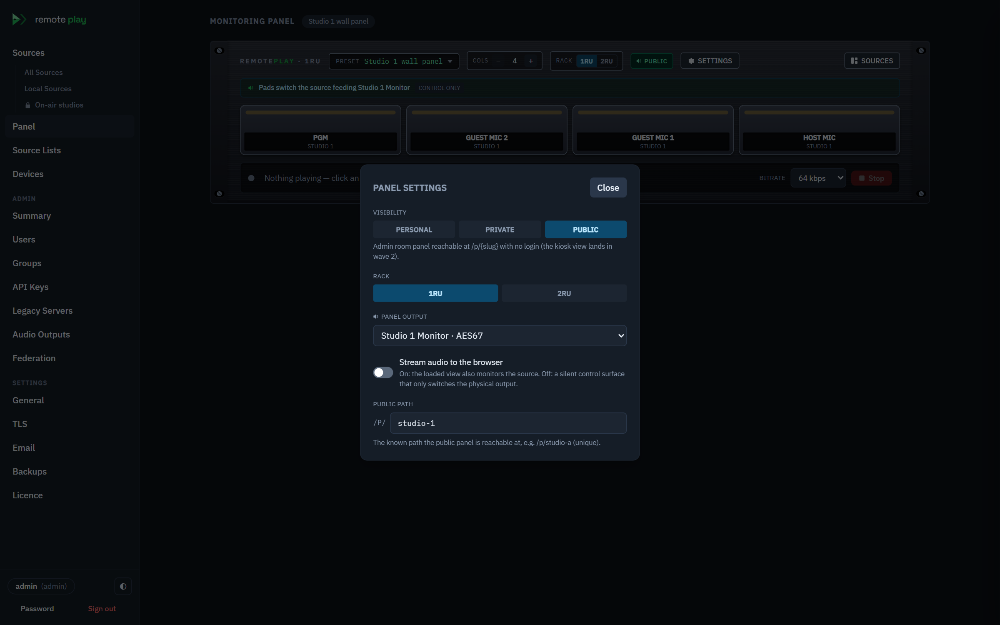

| Setting | What it does |
|---|---|
| **VISIBILITY** | **PERSONAL**, **PRIVATE** or **PUBLIC** — see below. |
| **RACK** | **1RU** or **2RU**. 1RU is a single row of pads; 2RU is two. |
| **PANEL OUTPUT** | The audio output the active pad's source is routed to. Room panels require one: *"Assign an output — room panels route the active pad's source to it."* |
| **Stream audio to the browser** | *"On: the loaded view also monitors the source. Off: a silent control surface that only switches the physical output."* |
| **PUBLIC PATH** | The slug a public panel answers on, e.g. `/p/studio-1`. Must be unique. |
| **Allowed users** | Private panels only: *"Comma-separated usernames who may access this private panel. Blank = any logged-in user."* |
| **Allowed groups** | Private panels only: *"Members of a ticked group may access this private panel (in addition to the users above)."* With no groups defined it reads *"No groups defined — create them under Admin › Groups."* |

The allow-lists appear only when **PRIVATE** is selected — a public panel is
open to every session, and a personal one to nobody but its owner.

**COLS** on the toolbar sets how many pads per row, independently of the rack
size. A 1RU panel with four columns is four pads; a 2RU panel with eight is
sixteen.

Once an output is bound, the panel carries a banner reading *"Pads switch the
source feeding {output}"*, with a **CONTROL ONLY** chip when browser audio is
off. That is the wall-panel case: the operator presses a pad, the physical
output follows, and nothing is streamed to the browser at all.

### Visibility: personal, private and public

| Visibility | Who reaches it | Output binding |
|---|---|---|
| **PERSONAL** | Only its owner. *"Your own monitoring layout — browser listen only, no output binding."* | None — a personal panel cannot drive an output. |
| **PRIVATE** | Any signed-in user; or, once **Allowed users** or **Allowed groups** is set, only those accounts and the members of those groups (admins always). | Required. |
| **PUBLIC** | Any signed-in user, at the panel's own path `/p/{slug}`. | Required. |

> **Public does not yet mean anonymous.** The in-app hint reads *"reachable at
> /p/{slug} with no login (the kiosk view lands in wave 2)"*. The kiosk view
> **has** shipped, but the no-login half has not: the endpoint behind it is
> still gated on a valid user session, and an external panel token — the `pt_`
> credential issued under **Panel control** — satisfies only the panel policy,
> not this one. A wall display therefore still needs a signed-in browser
> session today. Treat the hint as stale on both counts.

### The kiosk view

A public panel opens at `/p/{slug}` as a chrome-free view: the panel name, the
rack, and nothing else — no sidebar, no navigation away from it.

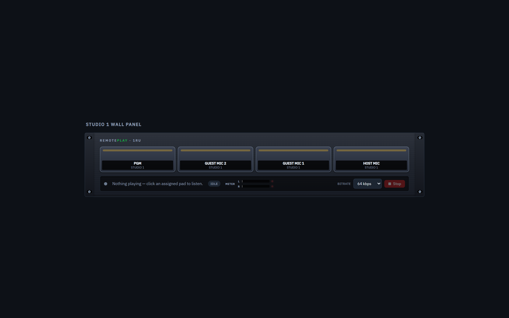

Pads behave exactly as they do in the console: pressing one makes it the active
pad and routes its source to the panel's output. A pad whose source is not in
live inventory shows **MISSING** rather than disappearing, so a wall panel does
not silently reshuffle when a device drops off air. If the slug does not match
a public panel, the view says so: *"No public panel at "{slug}" — check the
address with your administrator."*

A **Talk** key placed on a room panel renders differently here than everywhere
else it appears. A kiosk display has no station logon of its own — it is a
shared wall screen, not a signed-in operator's intercom — so a talk pad on a
kiosk is a static, read-only key: it shows the channel's live name (still
resolved from the network, the same as any other pad) and a **TALK** badge,
with no lamp, no key press and no listen level, plus a link to open the full
[Remote Talk client](#the-talk-client) in a new tab for anyone who needs to
actually talk or listen. See [Panels and kiosk displays](#panels-and-kiosk-displays)
under Remote Talk for the reason a kiosk key can't tally who's talking today.

---

## 6. Audio outputs

An audio output makes the server an audio **emitter**, not just a browser
gateway. A source routed to an output is passed through as live audio — RTP in,
PCM out — *in addition to* the Opus stream a browser might be listening to.
This is what lets a panel press change what comes out of a studio's overhead
speakers.

**Audio Outputs** is admin-only. An **ALSA** output needs GStreamer on the
server; an **AES67** output is built in, with its own PTP clock — see the
platform notes in [Getting started](#2-getting-started) for the port-319/320
privilege it wants.

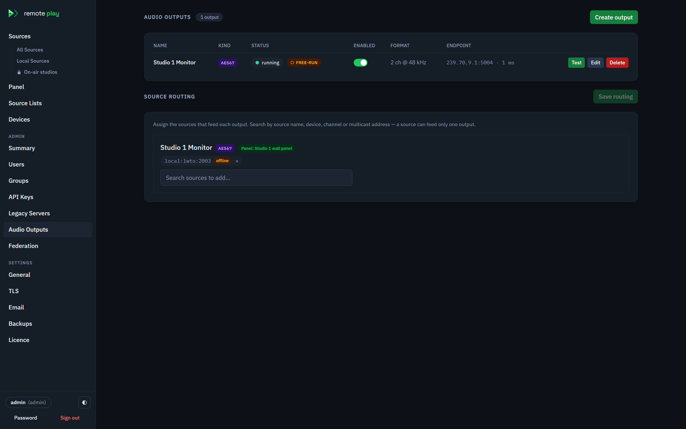

The table lists each output's **NAME**, **KIND**, **STATUS** (**running**,
**stopped** or **error**), an **ENABLED** toggle, **FORMAT** and **ENDPOINT**.
**Test** pushes tone to the output so it can be confirmed at the speaker
without routing a source to it.

Three kinds:

| Kind | Endpoint | Notes |
|---|---|---|
| **ALSA** | A device string such as `hw:1,0` | Linux hosts. |
| **AES67** | A multicast group, port and packet time | Sends AES67 onto the AoIP network. |
| **ASIO** | An ASIO driver name | *"ASIO runs on Windows hosts only."* On a non-Windows console the picker is disabled with *"This console isn't running on Windows — the ASIO device can't be configured from here."* |

### Configuring an AES67 output

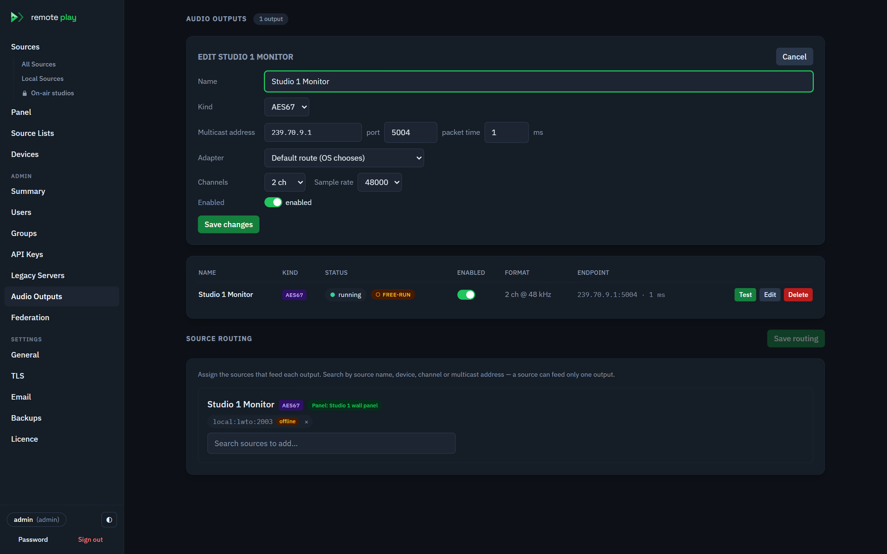

| Field | Meaning |
|---|---|
| **Name** | Free text; what the panel's output picker and the routing editor show. |
| **Kind** | **AES67**. |
| **Multicast address** | The group the stream is sent to, e.g. `239.70.9.1`. Validated: *"Enter a valid multicast address (e.g. 239.69.1.5)"*. |
| **port** | Destination UDP port; AES67 convention is 5004. |
| **packet time** | Packet time in **ms**. 1 ms is the AES67 interop point — at 48 kHz that is 48 frames per packet. |
| **Adapter** | The egress interface. **Default route (OS chooses)** lets the host decide; on a multi-homed server pick the AoIP NIC explicitly, or the RTP leaves on the wrong network. An adapter that no longer exists is marked **not found on this host**. |
| **Channels** / **Sample rate** | 2 ch @ 48000 for a normal stereo AES67 stream. |
| **Enabled** | Whether the sender runs. |

The output is announced over SAP so AES67 receivers can discover it, and the
announcement declares the sender's clock. A clock chip shows which: **PTP**
(*"Locked to PTP grandmaster … — clock-compatible with the AES67 plant"*) or
**Free-run** (*"Free-running on the system clock. Receivers that require a
shared PTP clock may refuse to subscribe."*). Free-run is legal and announced
honestly, but a Dante or Ravenna receiver may decline it.

### Routing sources to outputs

**SOURCE ROUTING**, below the table, is the persistent assignment: *"Assign the
sources that feed each output. Search by source name, device, channel or
multicast address — a source can feed only one output."*

Each output lists what feeds it, and carries a **Panel: {name}** chip when a
panel drives it — *"This output is driven by a panel — the selected pad routes
its source here."* A routed source that has left the inventory is marked
**offline**: *"This source is routed but is not in the live inventory right now
— the device may be offline or renamed. The route is kept."* Routes survive the
source going away, which is what you want when a studio is simply switched off
overnight.

Changes are staged until **Save routing**; an **Unsaved routing changes** note
appears while they are.

## 7. Server administration

### Groups

A group collects users so a panel or a source list can be granted to all of
them at once, rather than naming each account on every panel.

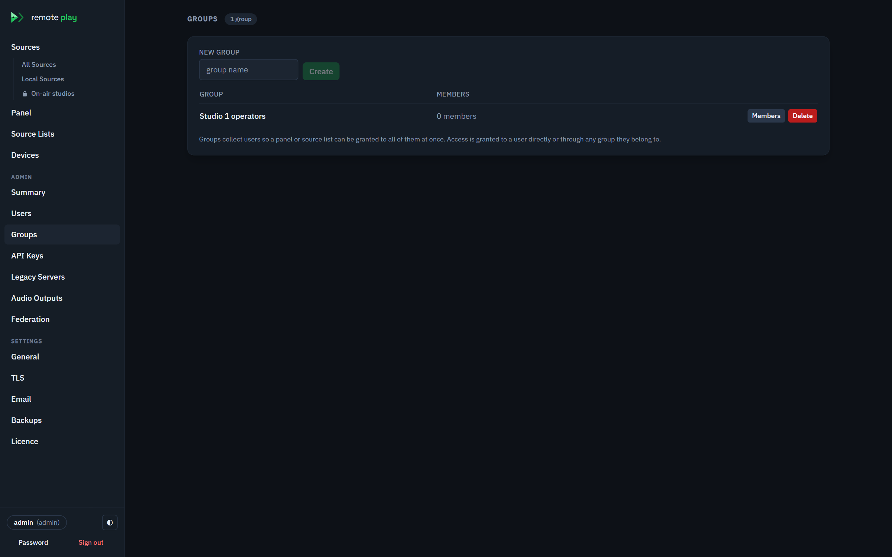

**New group** creates one; **Members** picks the accounts in it. The page's own
summary states the rule: *"Groups collect users so a panel or source list can be
granted to all of them at once. Access is granted to a user directly or through
any group they belong to."* Deleting a group is not silent about consequences —
*"Delete group "{name}"? Panels and lists that grant it lose that grant."*

Grants are additive and independent: a user reaches a private panel if they are
named on it directly **or** belong to any group it grants. Administrators always
have access regardless.

> The **Allowed groups** hint in panel settings says *"Enforced in wave 2"*.
> For private panels that is out of date — group membership is already checked
> server-side when deciding who may drive a panel.

### General

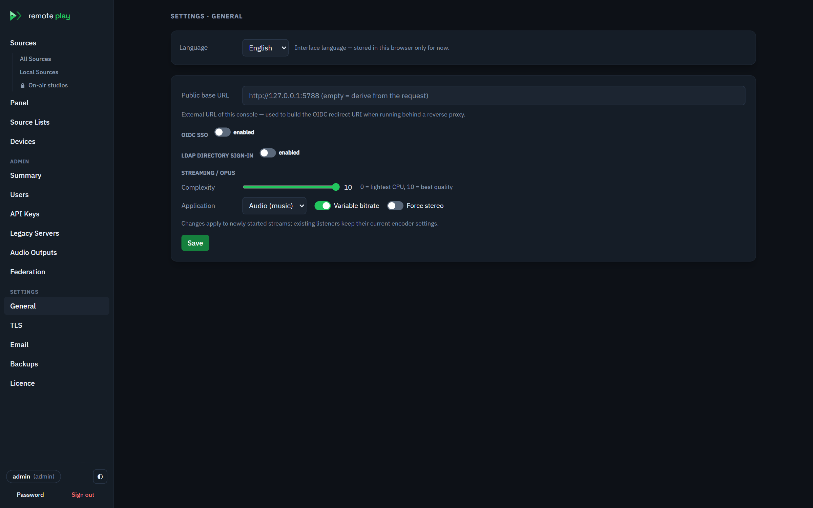

**Public base URL** is the address the server advertises for itself; blank
derives it from the request. **OIDC SSO** and **LDAP directory sign-in** are
configured here, each with **Role mappings** that translate a claim value or
directory group to the **admin** or **user** role — *first match wins*, with a
**Default role** and an option to **refuse unmapped users**. The redirect URI
to register with an OIDC provider is shown for copying, and *"Internal sign-in
always remains available as break-glass"*, so a misconfigured provider cannot
lock everyone out. **Test connection** validates LDAP against the **saved**
settings, so save before testing.

**Streaming / Opus** controls the encoder every browser listener gets:
**Complexity** (*"0 = lightest CPU, 10 = best quality"*), **Application**
(**Audio (music)**, **VoIP (speech)** or **Low delay**), **Variable bitrate**
and **Force stereo**.

### TLS

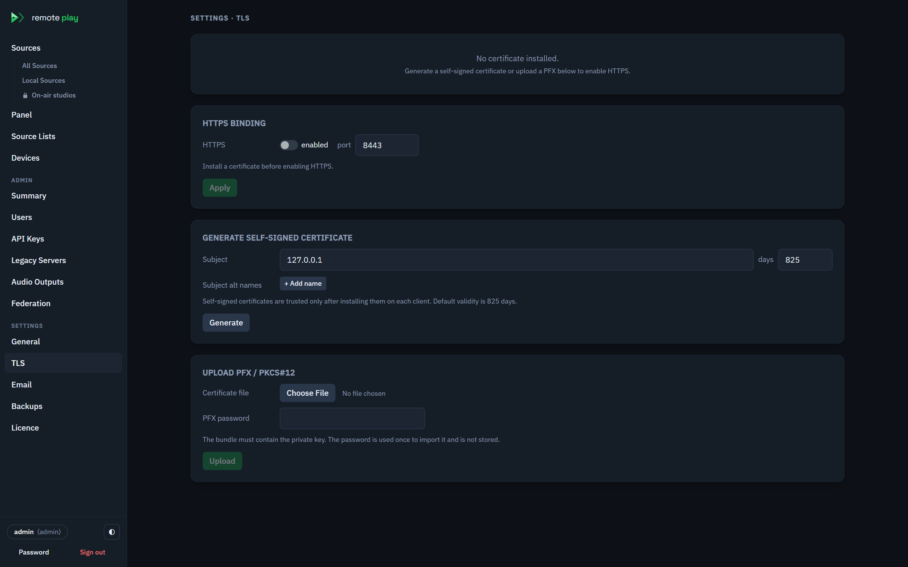

**Current certificate** shows the installed certificate's **Subject**,
**Issuer**, **Validity**, **Thumbprint** and **Subject alt names**, along with
its source (**uploaded** or **self-signed**) and how long it has left — *"Valid
— {days} days remaining"*, *"Expires in {days} days … renew soon"*, or
*"Expired on {date}"*.

Below it, **HTTPS binding** enables HTTPS on a chosen port (*"Install a
certificate before enabling HTTPS"*), **Generate self-signed certificate**
mints one for a list of DNS names or IPs, and **Upload PFX / PKCS#12** installs
a real certificate. **Remove certificate** disables HTTPS again.

### Email

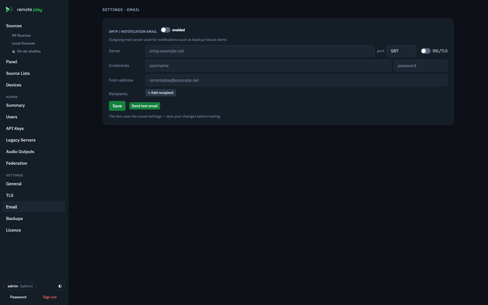

*"Outgoing mail server used for notifications such as backup-failure alerts."*
Server, port, SSL/TLS, optional credentials and the From address. A stored
password is never returned to the browser — the field shows **password set**,
and *"leave the field empty to keep it"*.

### Backups

**Settings › Backups** is a placeholder in this build: *"Scheduled device
config backups are coming with a later stage of the port."* Device
configuration backup itself lives under **Devices**.

## 8. Licence

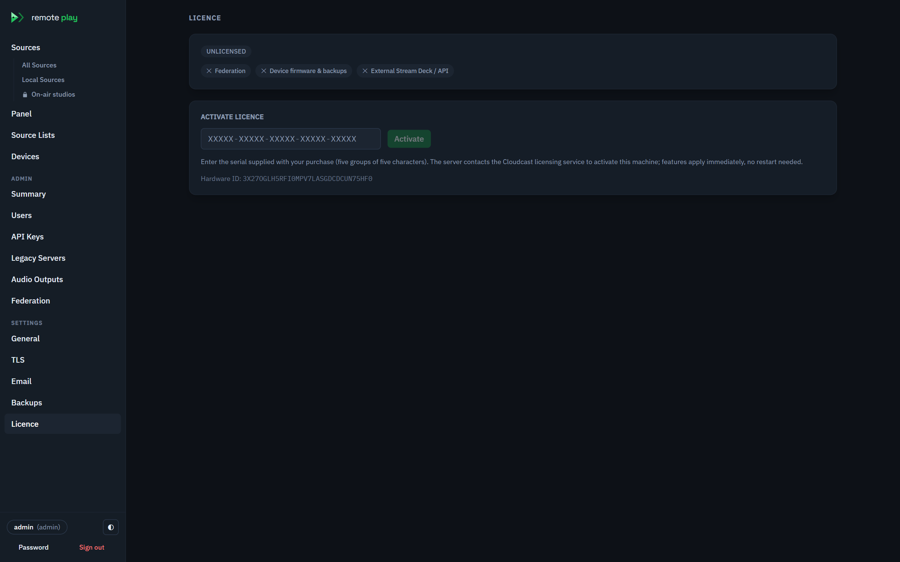

**Settings › Licence** shows whether the installation is **Licensed** or
**Unlicensed**, and for a licensed one the **Licensed to** name, **Serial**,
**Issued** date and **Expires** date — which may read **Never (perpetual)**.

Activation takes a serial: enter it under **Activate licence** and press
**Activate**. Activation is bound to the machine, and the page shows the
**Hardware ID:** the licence is issued against, which is what support needs
when a serial has to be reissued for new hardware. **Deactivate licence**
releases it.

A licence grants named features. Four are gated in this build:

| Feature | What it unlocks |
|---|---|
| **Federation** | Aggregating sources from peer servers. |
| **External Stream Deck / API** | Panel tokens and the external control API. |
| **Device firmware & backups** | Firmware banks and device configuration backup/restore. |
| **Remote Talk** | The intercom: station logon, talk/listen keys, and the Talk Plan admin pages. |

Reaching a gated feature without a licence shows the reason inline: *""{feature}"
requires a licence — install one under Settings › Licence."* Audio monitoring
itself is not gated — an unlicensed server still discovers sources and streams
them to a browser, so a plant is never taken off air by a licence problem.

**Remote Talk is gated differently — a timed preview, not a hard stop.**
Where Federation and device management simply disable their pages, an
unlicensed station can still log on and a channel can still be talked or
listened to: the connection gets a **5-second** live audio preview, then the
socket closes with *"Remote Talk preview ended — a licence is required to
continue."* and does not reconnect on its own. Nothing about choosing a
station or seeing your assigned keys is blocked — only the audio.

---

## 9. Remote Talk

Remote Talk is a browser-based intercom built into the same console: an
operator's browser opens a microphone and a live audio connection to the
server, keys into shared channels, and hears everyone else on that channel
except themselves — the same operational shape as a hardware party-line
system (Clear-Com, RTS and similar), with no beltpack and no intercom panel.

> **The full architecture brief lives alongside this file.** For the deep
> version — the ten-millisecond mix matrix, mix-minus worked through, the four
> channel kinds, the panel plane, recording, and the federated fleet, all with
> hand-drawn schematics and the measured cost model — open
> **[remote-talk.html](remote-talk.html)** (a self-contained page in this
> folder). This chapter is the operator-and-admin walkthrough; that page is the
> engineering reference. Cross-references below point into it by section.

### The mental model

Four questions, four objects. Almost every configuration mistake in Remote Talk
comes from answering one of them with the wrong object, so it is worth fixing
them in mind before opening any editor.

| Question | Object | Set up on |
|---|---|---|
| **Who** is on the intercom? | **Station** | Talk Plan › **Stations** |
| **What** can they talk on? | **Channel** | Talk Plan › **Channels** |
| **How** does it look to them? | **Panel profile** | Talk Plan › **Profiles** |
| **Where** does the audio mix? | **Homed on**, per channel | Talk Plan › **Channels** |

A useful way to hold it: a **station is a seat, not a person**. "Camera 2" is a
seat that exists whether or not anyone is sitting in it, and whoever is rostered
today signs in and takes it. Channels are the wires between seats. A panel
profile is the sticker-set on the physical panel in front of the seat. And
homing is which building the wires physically meet in.

#### People versus channels — the distinction that matters most

A key on a panel can point at one of exactly two things, and the difference
governs privacy, setup effort and who can hear you.

- **A key pointing at a channel** is a *bus*. Everyone who has that channel on
  their panel and is listening hears everyone who keys it. It is a party line, a
  ring-down group, a conference. You create the channel once and grant it to
  everyone who needs it.
- **A key pointing at a person** — a **station key** — is a *private line to one
  seat*. No channel exists for it in the plan, no administrator draws it, and no
  third station can join it or see it. The server materialises a hidden line
  when both ends are logged on and tears it down when they aren't.

In the profile editor this is the **Target** column: **Channel** or **Person**.
Choosing **Person** swaps the channel picker for *"Choose a station…"*.

Reach for a channel when the same conversation should be heard by a *group*, and
for a person key when one named seat needs to reach another named seat without
anyone else hearing. A production of twenty people typically has half a dozen
channels and a great many person keys — the person keys are the cheap ones,
because they need no plan entry at all.

The one thing person keys cannot do is exist for somebody who isn't logged on.
A channel is always there; a private line only forms when both ends are live.

### Concepts

| Term | Meaning |
|---|---|
| **Station** | A predefined intercom identity — like a SIP extension — with a display name, an allowed set of channels, and a panel profile of keys. A signed-in user logs on to a station; a station is online in one place at a time. |
| **Channel** | A shared audio bus, one of four kinds — **Party line**, **Group**, **P2P**, **IFB**. See [Channels](#channels-the-four-kinds). |
| **Panel profile** | The named layout of keys a station renders when someone logs on to it. |
| **Talk key** | Opens the mic into a channel or a private line. **Hold** for momentary, **tap** to latch, depending on the key's **Talk mode**. |
| **Listen key** | Subscribes to a channel's mix without opening the mic, with its own level control per key. |
| **Tally** | The lamp on a key lights whenever someone is talking on that channel — including you, with a small mic badge to tell the two apart. |
| **Production** | A grouping above stations, used by the station picker so an operator working one show doesn't scroll past every other show's seats. |
| **Monitoring** | The same connection a station uses for the intercom can also carry an ordinary Remote Play source, mixed in alongside the talk channels. |
| **Dim / duck** | Turning a programme feed down while somebody is talking over it, and restoring it the instant they stop. |
| **Homing** | Which instance's mix matrix actually mixes a given channel. |

### Stations

**Talk Plan › Stations** lists every station with its live **Status**
(**Online** or **Talking** while logged on, **Disabled** if switched off, blank
otherwise), its assigned users and groups, its allowed channels, and its panel
profile.

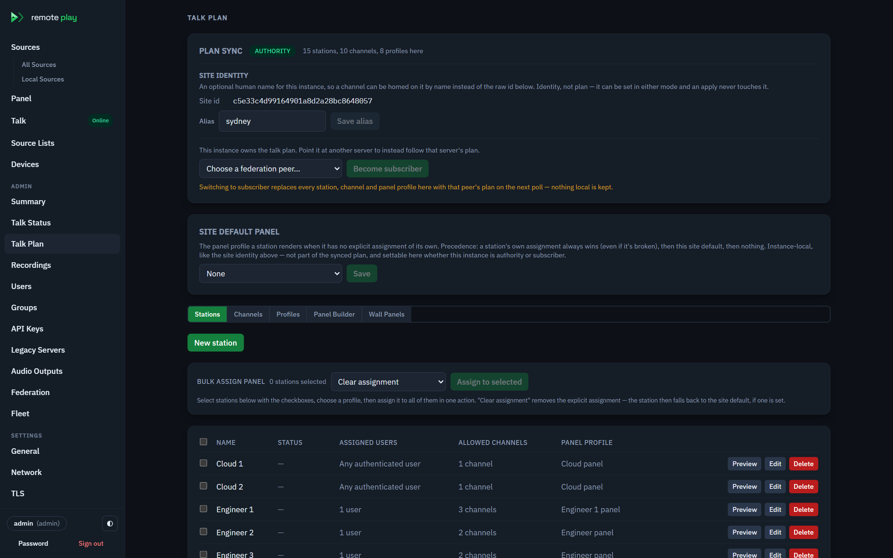

The station editor has five controls, and each answers a different question.

**Name** — what the seat is called. This is what appears on other people's
panels when they have a person key to it, and in the station picker. Name it
after the *role*, not the person: **Camera 2**, **Stage Left**, **VT**. Roles
outlive rosters.

**Enabled** — *"Disabled stations refuse logon and aren't advertised as a
source."* Disabling is the reversible way to take a seat out of service; it does
not delete the station or its keys, and other panels keep their person keys to
it (those keys simply never connect). Deleting, by contrast, warns: *"It's
removed from every channel's talker list immediately. A station currently logged
on stays connected until the user logs off — the next logon attempt is then
refused."*

**Assigned users** — *"Empty = any authenticated user may log on. Admins can
always log on regardless of this list."* This is the single most
misunderstood control on the page, because **empty means open, not closed**. A
brand-new station is reachable by every account on the instance until you
restrict it. The editor states the resulting posture back to you in plain words:
*"Open — any authenticated user may log on."*, or *"Restricted to the listed
users, plus any listed groups' members."*

**Assigned groups** — *"Members of any listed group may also log on — access is
users plus groups."* Access is the **union** of the two lists, never the
intersection. Groups are the right tool for a crew that changes weekly: add the
group to the station once and manage membership on **Admin › Groups**. With
groups only and no individual users, the summary reads *"Restricted to the
listed groups' members only (no individually assigned users)."*

**Allowed channels** — *"Channels this station may key up."* This is the seat's
authority, and it is enforced at the server, not at the panel. A key can exist
on a profile for a channel the station isn't allowed on — it renders, and it
won't work. The Panel Builder warns about exactly this case rather than
silently omitting the key.

**Panel profile** — which layout this seat renders, or **None — no keys**. See
[Panel profiles](#panel-profiles) for what a profile contains and
[Which panel a station actually renders](#which-panel-a-station-actually-renders)
for how this interacts with the site default.

#### One seat, one place at a time

A station can be live in exactly one browser. The station picker shows each
station's occupancy before you commit: **free**, *"held by you elsewhere"*, or
*"in use by {name}"*, with a running count in the header — *"{free} of {total}
free"*.

The rule is **one seat per user, and you may only take over your own**:

- A seat **you** hold in another tab or on another device offers **Take over** —
  claiming it releases the old session and drops its socket. This is the escape
  hatch for the laptop you closed without logging off.
- A seat **somebody else** holds is simply blocked, with *"in use by {name}"*.
  There is no override in the UI; find the person, or have an admin disable and
  re-enable the station.
- Asking for seat B while you hold seat A releases A automatically. You are never
  in two seats at once.

This is deliberate. An intercom seat live in two places has two open microphones
and two sets of tally, and neither operator can tell which is which. A logon
refused for this reason reports *"That station is already logged on elsewhere."*

#### Managing access from the person's side

Editing station by station is the wrong shape when you are onboarding a person
rather than building a plan. **Admin › Users › Talk Access** inverts it: pick a
user or a group on the left and see *"— talk station access"* on the right,
listing their
**Assigned stations** and, separately, the **Open stations** every authenticated
user can already reach (*"Open (any user)"*).

It carries three bulk tools:

- **Add stations…** — *"Adds this user to the selected stations' assigned-user
  list."*
- **Bulk access** — assign many users, or many groups, to one station at once.
- **Clone access** — *"Copies one user's explicit station assignments onto
  another user. Stations open to everyone aren't touched — they already reach
  the target user."* This is the fast path for "give the new operator what the
  old one had".

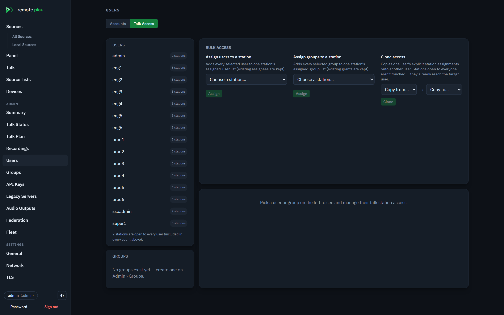

One warning here deserves attention because it changes behaviour for people you
weren't editing: *"At least one selected station is currently open to every
user. Adding this user to it converts it from \"anyone\" to just its
assigned-user list (now including this user) — the other users who could log on
today no longer could."* Adding the first assignee to an open station **locks it
down**.

### Productions and teams

A **production** is a boundary drawn around part of the plan, so one server can
carry several unrelated shows without them hearing each other. Where an instance
runs a single show it can be ignored entirely — everything sits in the org's
implicit default production and behaves exactly as it did before productions
existed.

Six rules govern it, and three of them are worth an operator's attention:

- **A channel is either scoped to one production or marked org-wide, never
  both.** Org-wide is how an all-call or a safety channel reaches everybody.
- **A station may only be granted channels from its own production, plus the
  org-wide ones.** This is validated when you author it *and* re-checked at
  logon, so a channel that drifts out of scope is dropped rather than honoured.
- **Station keys are contained by production.** A person key may not target a
  station in a different production unless the authoring station is explicitly
  allowed to cross. Without that containment a shared panel would be a way to
  dial into another show's crew, which is precisely the hole productions exist
  to close.

Moving a station between productions is audited and **force-drops its live
session** — the operator is disconnected, because their allowed channels have
just changed underneath them.

A **team** is a production-scoped bundle of roles used as a **template** when
provisioning people, not as a live authority. Changing a team does not
retroactively re-permission anybody; it changes what the next person stamped from
it receives. If you need a live grant that follows membership, use a **group** on
the station's **Assigned groups** instead — that *is* evaluated at logon.

### Channels: the four kinds

**Talk Plan › Channels** lists every channel's **Kind**, talker count, whether
listening is open, where it's homed, its priority and any output bridge.

The kind is not cosmetic — it decides who may key up and who may hear.

| Kind | Who can talk | Who can hear | Use it for |
|---|---|---|---|
| **Party line** | every assigned member | everyone on it | The default. Crew conversation where anyone may speak — camera crew, lighting, general production. |
| **Group** | only the listed **Talker stations** | anyone, if **Listener open** | One-to-many with discipline. A director's ring-down to the floor, where the floor listens but cannot key back on that channel. |
| **P2P** | exactly two stations | those two | A permanent private line between two named seats, drawn in the plan (as distinct from an ad-hoc person key, which needs no plan entry). |
| **IFB** | the interrupt talkers | the talent | Talent earpiece. Carries a programme feed and ducks it while somebody interrupts. |

**Talker stations** — *"Stations allowed to open a mic into this channel."* For
a **Party line** this is the membership. For a **Group** it is the privileged
few. A **P2P** channel enforces *"A P2P channel needs EXACTLY two talker
stations."* and counts as you pick (*"{count} of 2 selected"*).

**Listener open** — *"On = any station may listen. Off = only the listed talkers
may listen."* This is what makes a Group channel useful: talkers restricted,
listening wide open. The list column shows **Open** or **Talkers only**.

**Priority** — *"Interrupt precedence when several channels talk at once — higher
wins."* This matters when more than one IFB can interrupt the same ear: give the
director a higher priority than the producer and the director's interrupt takes
the ear.

**Output bridge** — an optional audio output the channel's mix is *additionally*
sent to. This is how a talk channel reaches hardware: a wall speaker, a
loudspeaker in a scene dock, a feed into a hardware matrix. Without it a channel
exists only for browser sessions.

#### IFB channels: programme source and dim

An **IFB** channel additionally takes a **Program source** — *"The program feed
this IFB channel interrupts/dims. Required for IFB channels; a talk
station/channel can't be used as the program source."* It is any ordinary
discovered source: a Livewire feed, an AES67 stream.

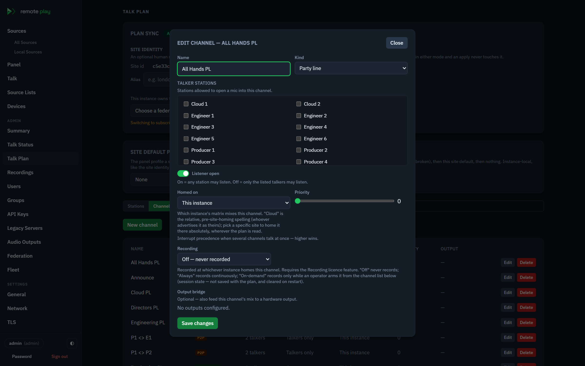

The **Dim** control decides how far that programme is pulled down while somebody
interrupts. Left alone it uses the **Engine default**; switching on **Custom dim
level** exposes a slider, *"How far the program is ducked while an interrupt
talker is active."*

The dim is **not a standing attenuation**. It engages only while somebody is
actually keyed on that IFB and lifts the moment they stop. Talent hears full
programme the rest of the time.

#### Homed on — where the audio actually mixes

**Homed on** is the setting operators skip and then spend a week debugging
latency they didn't need to have. *"Which instance's matrix mixes this channel.
\"Cloud\" is the relative, pre-site-homing spelling (whoever advertises it as
theirs); pick a specific site to home it there absolutely, wherever the plan is
read."*

Three choices:

- **This instance** — mix it here.
- **Cloud** — mix it at whichever instance advertises itself as the cloud. This
  is *relative*: it resolves differently depending on which instance reads the
  plan.
- **Site: {site}** — mix it at one named site, absolutely, wherever the plan is
  read. Sites are named by the **Alias** on the Plan Sync panel.

**Why it matters.** Every participant on a channel needs an audio path to
wherever that channel mixes. Home a channel badly and audio takes a needless
round trip.

- A **London crew's own party line**, homed **on London**, mixes locally: two
  London desks talking to each other never leave the building. Home the same
  channel on the cloud and every word makes a round trip to another region and
  back, adding latency to a conversation that never needed to leave.
- A **fleet-wide all-call**, homed on the cloud, costs each site exactly **one**
  audio leg to the cloud regardless of how many people that site has on it. Home
  it at one site instead and every other site's members each pull a leg to that
  site.

The rule of thumb: **home a channel where most of its people are**. Local
conversation local; genuinely cross-site conversation central.

The constraint to respect: the site a channel names must be a reachable
federation peer of every instance carrying its members — a spoke cannot reach
another spoke unless they peer directly. Naming a site that hasn't announced
itself yet is rejected with *"Site \"{value}\" isn't recognised yet — home a
channel on this instance, or on a federation peer that has advertised its site
identity (that takes one poll)."*

Homing also decides **where a channel is recorded** — at home, exactly once,
rather than once per site.

### Panel profiles

A **panel profile** is a named set of keys. It is the layout, not the rights:
what an operator *sees* and *where*. What they are *allowed* to do comes from the
station's **Allowed channels**. Keeping those two separate is what lets one
shared profile be handed to twenty stations, each of which resolves it against
its own permissions.

**Talk Plan › Profiles** lists each profile and its key count. Inside, keys are a
table — one row per key — plus a live preview.

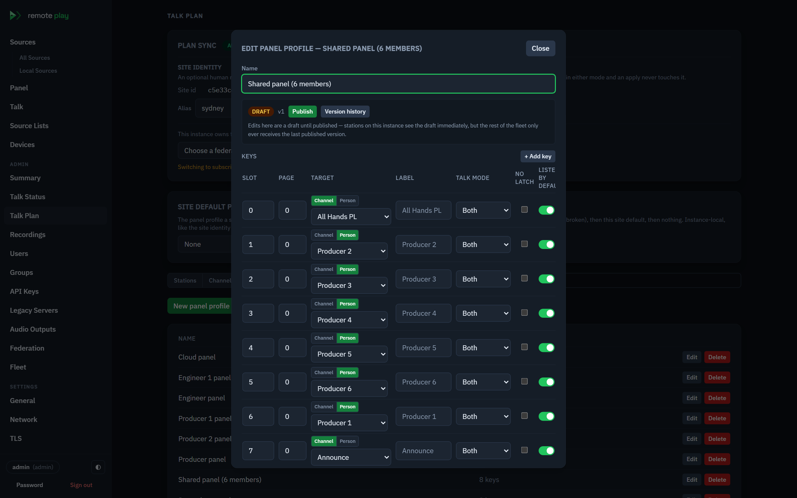

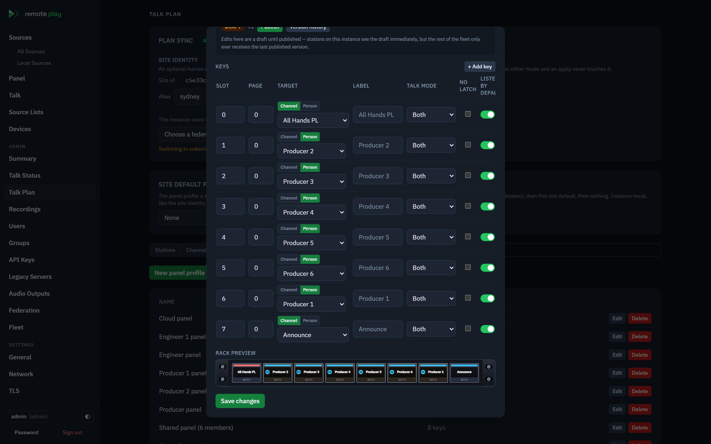

#### The columns, one at a time

**Target** — **Channel** or **Person**, as described in
[People versus channels](#people-versus-channels--the-distinction-that-matters-most).
Choosing one clears the other; the server refuses both (*"Key {slot}: choose
either a channel or a target person, not both."*) and neither (*"…choose a
channel or a target person."*).

**Slot** — the key's position in the rack, numbered from 0. Two keys cannot share
one: *"Two keys can't share the same slot (highlighted in red)."* Slots are how
you get muscle memory — the same channel in the same place on every panel in the
building means an operator can hit it without looking.

**Page** — *"The rack surface page this key lives on (0..32) — slot numbering
restarts on each page."* A profile with more keys than one rack shows spans
several pages, and the client renders a page selector (*"Page {n}"*). Because
numbering restarts, slot 0 on page 0 and slot 0 on page 1 are different keys.
Use pages to separate *modes of work* — page 0 for the channels needed
constantly, page 1 for the ones needed at a scene change — rather than simply
overflowing.

**Label** — free text, up to 64 characters, falling back to the channel or
person's name when blank. Panels are read at a glance and in a hurry: **FLOOR**
beats **Studio 3 Floor Party Line (main)**.

**Talk mode** — **Momentary**, **Latching** or **Both**.

- **Momentary** — the mic is open only while the key is physically held. Nothing
  can be left open by accident. Correct for anything that interrupts.
- **Latching** — tap to open, tap to close. Correct for a conversation you're
  going to be in for ten minutes.
- **Both** — the hold-versus-tap split: hold it and it's momentary, tap it and it
  latches. The comfortable default for general crew channels.

**No latch** — forbids latching on a **Momentary** or **Both** key, for
discipline-critical channels where a stuck key would go to air. The client says
*"Momentary only — this key can't be latched. Hold to talk."* It is greyed out on
a **Latching** key, with *"A latching key already can't be forbidden from
latching — this only applies to momentary/both keys."*

**Listen by default** — whether this key is already listening when the operator
logs on. Set it for the channels somebody must not miss: a director's ring-down
should be live from the moment they sit down, not after they remember to open
it.

**Default level** — the listen level this key starts at (it can start muted),
before any personal adjustment. Use it to pre-balance a panel: programme at
full, background chatter a few dB down.

**Colour** — the lamp colour, from the same six-swatch palette panels use
(**amber** — the default, **red**, **green**, **blue**, **violet**, **pink**),
or a custom hex. Colour-code by *function*, not prettiness: red for anything that
goes to air, amber for production, green for private lines. An operator scanning
a rack finds the red one without reading it.

> **Known issue (RPC-250).** In the shipping build the talk pad does not render a
> key's configured colour, and a key left with *no* colour set loses its talk
> fill, glow and tally ring as well. Until that lands, treat colour as authored
> intent rather than something you can rely on seeing, and don't use it as the
> only way to distinguish a critical key — position and label carry the load.

#### The rack preview

Below the key table sits **Rack preview** — the profile as it will actually lay
out, updating as you edit (*"Add a key to see the rack preview."* while empty).
Use it. A key table sorted by slot number tells you nothing about whether the
panel is *usable*; the preview shows the gaps, the crowding, and whether the
channel someone reaches for in a hurry is where their thumb already is.

#### Drafts, publishing and rollback

Editing a profile produces a **Draft** until you **Publish** it: *"stations on
this instance see the draft immediately, but the rest of the fleet only ever
receives the last published version."* That asymmetry is the useful bit — you can
try a layout on your own instance without pushing it to every site.

**Publish** snapshots what is *saved*, not what is on screen: *"Save your changes
below before publishing — Publish snapshots what's already saved, not what's
still being edited here."* **Version history** lists every publish with who did
it, and **Roll back** *"re-publishes it as a new version — nothing is deleted
from the history."*

#### Which panel a station actually renders

Three things can decide it, in strict order:

1. **The station's own assignment** — always wins, *even if it's broken*.
2. **The site default panel** — *"The panel profile a station renders when it has
   no explicit assignment of its own."*
3. **Nothing** — no keys.

The **Effective panel** preview on each station answers "what will this person
actually see", resolved the same way logon resolves it, and labels which rule
applied: **Station assignment**, **Site default**, or **None**. A station whose
assigned profile has been deleted carries a **Missing** badge — *"This station's
assigned panel profile no longer exists — it currently renders nothing. Reassign
it or clear the assignment."* Note that a broken explicit assignment does **not**
fall through to the site default; it renders nothing. That is what "even if it's
broken" costs.

The site default is **instance-local** — like the site alias, it is not part of
the synced plan, and it can be set whether this instance is authority or
subscriber.

**Bulk assign panel** on the Stations tab handles fleets: tick stations, choose a
profile, **Assign to selected**. **Clear assignment** *"removes the explicit
assignment — the station then falls back to the site default, if one is set."*

### Walking through a talk plan

Building a plan in the order the tabs appear does not work — channels need
stations, and profiles need both. Build it in dependency order.

**1. Sketch it on paper first.** List the seats, then the conversations. For each
conversation write down who may *talk* and who may *hear*; that pair of answers
is what picks the channel kind.

**2. Create the stations.** One per seat, named for the role. Leave **Assigned
users** empty for now — it is open, which is fine on a plan nobody is using yet —
and come back to it in step 6. Leave **Panel profile** as **None — no keys**;
the profile doesn't exist yet.

**3. Create the channels.** Now that stations exist you can populate **Talker
stations**. Set **Listener open** deliberately on every Group channel. For each
IFB, pick its **Program source** and decide whether the **Engine default** dim is
enough.

**4. Set homing.** Before anyone uses it, set **Homed on** for every channel, even
in a single-instance install — the answer is **This instance** and writing it down
now saves a debugging session when a second site appears. See
[Homed on](#homed-on--where-the-audio-actually-mixes).

**5. Build the profiles.** Start from the busiest seat, because it exposes the
layout conventions the rest will inherit: which slot programme lives in, which
colour means on-air. Watch the **Rack preview**. Then assign each profile on its
station, or use **Bulk assign panel** where a profile is shared.

For a crew who all need private lines to each other, skip the manual work and use
the [Panel Builder](#panel-builder).

**6. Grant access.** Now close the stations down: set **Assigned users** or
**Assigned groups** on each. Prefer groups. Then check **Talk Access** per person
to confirm each operator sees exactly the seats they should — it is much easier to
read the wrong grant there than on the station list.

**7. Check each station's Effective panel** and confirm no **Missing** badges.

**8. Publish** every profile, if this instance is an authority for other sites.

### Panel Builder

Building a crew panel one key at a time is tedious and error-prone — an
eight-person crew who all need private lines to each other is 56 keys across 8
profiles, and each profile must omit exactly one person. **Talk Plan › Panel
Builder** does it in one action:

*"Build one shared panel for a group of people and assign it to all of them in
one action — pick the members, and each gets a key to call every other member
directly. Add ordinary channels too if the group also shares a party line or
similar."*

The trick it exploits is that **one profile renders differently for each
viewer**. A profile carrying a person key to every member is handed to all of
them; each member's own key is hidden on their own panel, because a private line
to yourself is nonsense. One profile, N different-looking panels.

- **Members** — *"Pick the stations that will share this panel. The order you
  pick them in sets their key order below."* Order matters and it is the pick
  order, not alphabetical; **Move up** / **Move down** adjust it.
- **Shared channels (optional)** — *"Ordinary channel keys added after the person
  keys — e.g. a party line the whole group already shares."*
- **Preview as** — pick any member and see their view, *"That member's own key is
  hidden, exactly as it would be on their real panel — a private line to yourself
  doesn't render."*
- **Build panel and assign to members** — creates the profile and assigns it to
  every chosen station at once, reporting *"Created \"{profile}\" and assigned it
  to {count} stations."*

A member who isn't allowed on a chosen shared channel isn't blocked, just
flagged: *"Some members aren't allowed on a chosen channel yet — the key will
render but won't work until the station is granted the channel."* Fix it on the
station's **Allowed channels**.

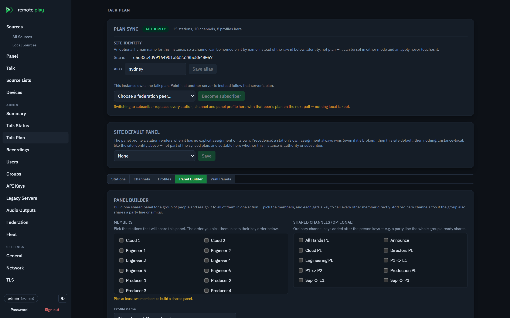

### Wall panels

A **wall panel** is an intercom that isn't a person: a tablet screwed to a wall
in a scene dock, a green room, a foyer. Nobody signs in to it, and it stays live
for months.

**Talk Plan › Wall Panels** provisions them. *"Mint a device token bound to one
station. A wall tablet opens the boot URL and is live — no login. The token and
URL are shown once."*

- Give it a **Name** (*"e.g. Foyer tablet"*), choose the station it is bound to,
  and pick a policy: **Listen only** or **Push to talk**.
- **Provision** mints the credential. *"Save these now — they are shown only
  once."* — you get a **Token** and a **Boot URL**. Put the boot URL in the
  tablet's kiosk browser and the panel comes up live.
- The list shows each panel as **Active** or **Revoked**, with *"last seen {age}
  ago"* or *"never used"*. **Revoke** kills a lost tablet instantly;
  **Re-enable** restores it.

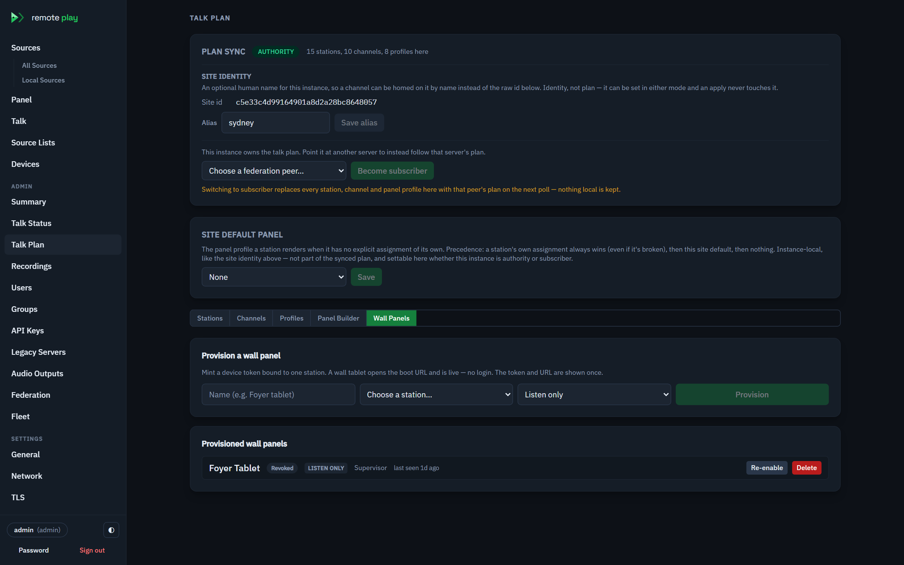

**Listen only** is the right default for anywhere the public can reach. A foyer
tablet that can key the director's channel is a liability; one that shows the
show relay is useful.

The panel itself is deliberately spare: **Live** / **Connecting…** / **Offline**,
each key showing **Talk** and **Listen** with **On air** and **Listening**
states, and **Recorded** where the channel is being recorded. If the station is
switched off it says so — *"This panel's station is disabled."*

Wall panels are a separately licensed feature: *"Wall panels need the
ExternalPanel licence feature."*

Note the distinction from a **kiosk** panel (`/p/{slug}`), which is an ordinary
monitoring panel shown read-only — see
[Panels and kiosk displays](#panels-and-kiosk-displays). A wall panel is bound to
a station and can carry live audio; a kiosk panel is not and cannot.

### Plan Sync: authority and subscriber

**Plan Sync**, on the Talk Plan page, is where an instance decides whether it
owns its talk plan or follows somebody else's.

- **Authority** — *"This instance owns the talk plan. Point it at another server
  to instead follow that server's plan."*
- **Subscriber of {peer}** — it pulls a read-only copy on the federation poll.
  Every Talk Plan tab shows *"This talk plan is centrally managed by {authority}
  — it's read-only here. Edit it from the authority instance instead."*

**Becoming a subscriber is destructive and the UI treats it as such.**
*"Switching to subscriber replaces every station, channel and panel profile here
with that peer's plan on the next poll — nothing local is kept."* The
confirmation counts what you are about to lose (*"{count} stations will be
replaced"*, and the same for channels and profiles) and makes you type the
authority's name. Going the other way is safe: *"Switching back to authority is
not destructive — the plan currently applied here simply becomes yours to edit
again."*

The panel also reports sync health: **Last applied version**, **Last applied**,
**Applies so far**, **Last sync error**.

Two drift warnings are worth watching, because they are silent failures of intent
rather than errors:

- *"The authority assigned these usernames to stations, but no account with that
  name exists on this instance yet — the station falls back to \"any
  authenticated user\" until one is created."* A restriction that doesn't
  resolve becomes **no restriction**.
- The same for groups: the station *"falls back to its other assignments (or to
  \"any authenticated user\" if it has none) until the group is created."*

**Site identity** sits alongside: a **Site id** and an optional **Alias**
(*"e.g. london"*) — *"An optional human name for this instance, so a channel can
be homed on it by name instead of the raw id below. Identity, not plan — it can
be set in either mode and an apply never touches it."* Aliases are lower-case
letters, digits, `-` and `_`, and may not be `local` or `cloud`.

### The /talk client

Signed-in users reach Remote Talk two ways. Inside the console, the **Talk**
sidebar entry opens a page with a station picker, a logon bar and the same key
grid, plus an **Open Talk client ↗** link. The dedicated **/talk** address is the
same intercom with none of the console chrome — a full-screen page meant to be
left open on its own monitor or a second device.

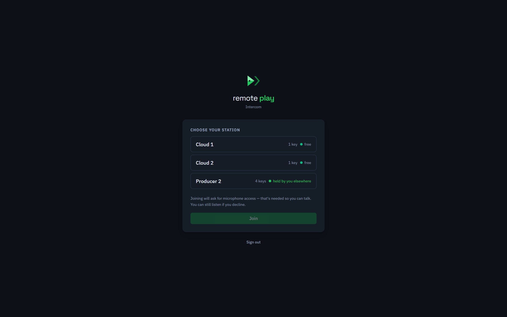

#### Choosing a production, then a station

Where an instance runs more than one show, the picker asks *"Choose your
production"* first, then *"Choose your station"* within it — so an operator on
one show never scrolls past every other show's seats. **Change** goes back.
Stations belonging to no production appear under **Unassigned**, and once joined
the header reads *"{production} — {station}"*.

The station list shows each station's key count and its occupancy — **free**,
*"held by you elsewhere"*, or *"in use by {name}"* — with *"{free} of {total}
free"* in the header, and **Take over** where offered. If nothing is listed:
*"No stations are assigned to your account yet — ask your administrator to assign
one."*

#### Joining

**Join** triggers the browser's microphone prompt. *"Joining will ask for
microphone access — that's needed so you can talk. You can still listen if you
decline."* Declining still lets every listen key work; it leaves talk keys inert,
with *"Microphone access was denied — you can still listen, but talk keys won't
work."* in the footer.

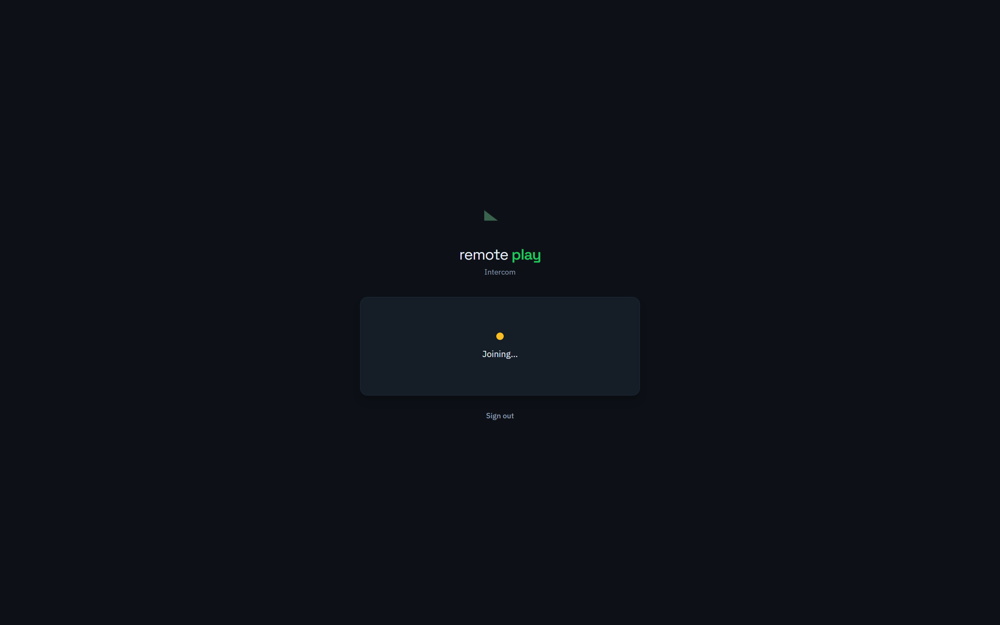

#### Working the rack

Each key is split into a **Talk** half and a **Listen** half.

- The **talk** half honours the key's **Talk mode**: hold for momentary, tap to
  latch, or both. A no-latch key says *"Momentary only — this key can't be
  latched. Hold to talk."* A key on a channel the station may hear but not key
  reads *"Listen-only key — you can hear this channel but not talk on it."*
- The **listen** half toggles subscription. Its level control opens **Listen
  level** with a gain slider in dB and **Mute**/**Unmute**. **Reset to default**
  clears your personal value — *"Clear your saved level and go back to this key's
  default ({value})"*.
- **Tally** shows *"{count} talking"*.
- A **Vol** control sets the **Master listen volume** across the whole rack.
- Multi-page profiles get a page selector, **Page {n}**.
- A recorded channel shows *"This channel is being recorded"*.

**Your listen settings are remembered** per station and restored on your next
logon — levels and mute state both. Personalisation is listen-only: it never
changes your talk rights or the layout, which the admin owns.

The footer carries the station name, the connection state (**Not logged on**,
**Connecting…**, **Online**, **Reconnecting…**), a **MIC** badge whenever any
key's mic is open, and **Leave**.

#### Reply

A **Reply** key dials back whoever last called this station, showing a
**Recent** caller list — *"No recent callers"* until somebody does. Callers
resolve to display names, falling back to *"Station {id}"* for one whose name
isn't known locally (a caller at another federated instance, typically). It
saves hunting for the right tile when a call comes in.

#### Monitoring a source, and personal IFB

A station can pull an ordinary Remote Play source into its own mix — **Monitor a
source** — so an operator hears programme without a second player or a second
set of headphones. Pick from *"Choose a source…"* and **Monitor**. There is a
per-station cap: *"At the {max}-monitor limit for this station — stop one to add
another."*

Each monitor has its own **Duck** — a personal IFB, configured by the operator
rather than by the plan. *"Personal-IFB duck: dips {db} dB while a talker is live
on the armed channel(s)"*. In **Duck settings**:

- **Duck while a talker is live**, with the dB amount, or **Mute while
  interrupted** to cut it entirely.
- **Counts as an interruption** — either **Any channel this station listens to**,
  or **Only these channels**.

That last choice is the useful one. An operator monitoring programme who ducks on
*any* channel will have programme dipping all day on general crew chatter; ducking
only on the director's channel dips it when it matters.

This is distinct from an [**IFB** channel](#ifb-channels-programme-source-and-dim):
an IFB channel is authored in the plan and ducks programme for *the talent*; a
personal duck is the operator's own preference for their own ears.

### Panels and kiosk displays

A **Talk** key can also be placed on an ordinary monitoring panel or room panel,
so an operator's regular panel carries both source pads and intercom keys side by
side. On a signed-in console session the key behaves exactly as it does at
[/talk](#the-talk-client) — the panel and the /talk client share the same
underlying connection, so a key pressed on one controls the same channel as the
other.

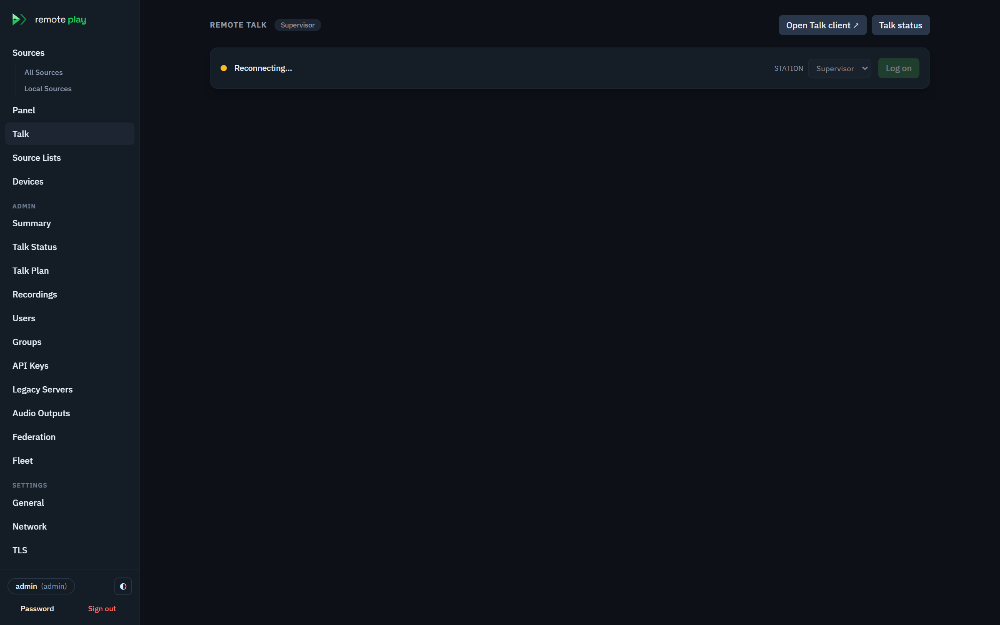

**A talk key on a kiosk (`/p/{slug}`) panel is different.** The kiosk view is a
shared wall display, not a signed-in operator's intercom, so it has no station
logon to drive a live key. A talk pad there renders as a static labelled key: the
channel's live name and a **TALK** badge, with a link that opens the full Remote
Talk client in a new tab. There is no lamp and no tally on a kiosk key.

If you want a wall display that *does* carry live audio and tally, provision a
[wall panel](#wall-panels) instead — that is exactly the gap it fills.

### Recording a channel

Any channel's mix can be recorded, at whichever instance **homes** it — so a
cross-site channel is recorded exactly once, at home, not per site. Recording is
its own licence feature (**Channel recording**), separate from Remote Talk.

Set a channel's **Recording** mode in the channel editor — *"\"Off\" never
records; \"Always\" records continuously; \"On-demand\" records only while an
operator arms it from the channel list below (session state — not saved with the
plan, and cleared on restart)."* An on-demand channel is started with **Arm** and
stopped with **Disarm**; its badge flips from *"On-demand"* to a red **REC**.

- **Privacy is enforced, not optional.** A recorded channel raises a *"This
  channel is being recorded"* indicator on every member's panel the moment they
  log on. A **P2P** line refuses recording unless the instance has explicitly
  enabled private-line recording *and* the mode is **Always** — *"A private (P2P)
  channel may only be recorded with \"Always\" — \"On-demand\" is never permitted
  for a private line."*
- **Storage.** Segments are Ogg/Opus files on local disk, rotated on a timer,
  each with a JSON timeline sidecar of who spoke and when (the **Timeline** view
  plays it back). A configured S3 bucket also receives them, using the instance's
  own AWS role, on a queue that never blocks recording and never deletes the
  local copy on failure.
- **Retention and legal hold.** A retention policy sweeps old local segments; a
  recording on **legal hold** (**Place hold** / **Release hold**) is exempt and
  refuses deletion until released.

The **Recordings** page filters by channel and date and offers **Play**,
**Timeline**, legal-hold and delete; the recorder's health is a **Recorder** card
on Talk Status. Full detail is in the
[architecture brief §07](remote-talk.html#c07).

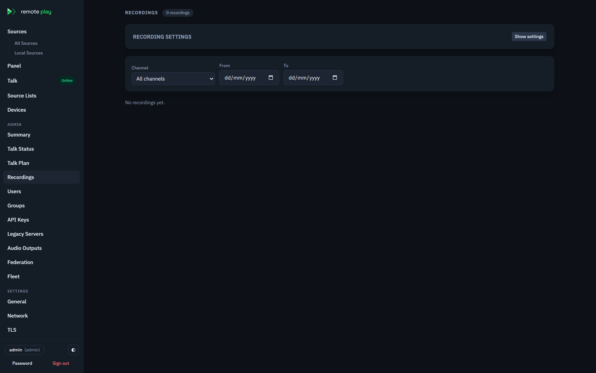

### Talk Status diagnostics

**Admin › Talk Status** (also reachable from the **Talk status** link on the Talk
page) is a live, read-only view of the mix engine and every logged-on station,
refreshing once a second while the tab is visible.

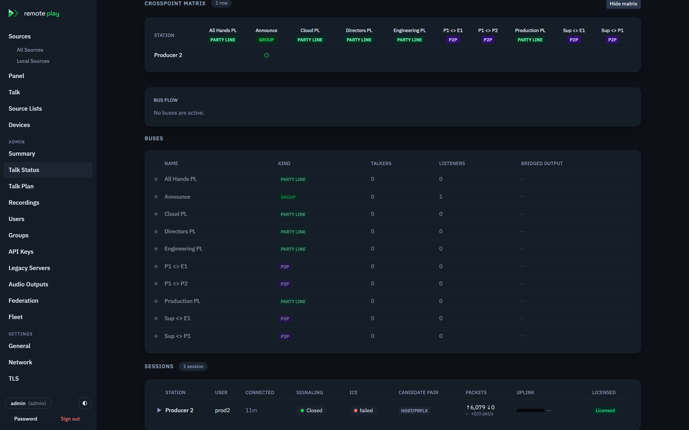

The **Mixer** card is the engine's own health: **Running**/**Stopped**, tick
count, **p50**/**p99** tick timing with a sparkline, **Missed deadlines** (should
stay at zero — a rising count means the mixer thread is falling behind), and
**Crosspoint ops**. The **Encoders** figure is the mixer's dedupe accounting made
visible: *"{encoders} encoders for {members} members"*, broken down as
*"{shared} shared + {personal} personal"*. Everyone on a bus who isn't talking
hears the identical mix and shares one Opus encode; only active talkers get their
own mix-minus encode. A ten-member party line with two talkers reads 3 encoders
for 10 members — seeing personal ≈ members instead means something is keeping
almost everyone "talking", most likely a stuck key.

The **Buses** table lists every bus with its **Kind** chip, live
**Talkers**/**Listeners** counts and any **Bridged output**; a dim row means
nobody is on it.

The **Sessions** table is one row per logged-on station: **User**, **Connected**
age, **Signaling** state, **ICE** state, the selected **Candidate pair**,
**Packets**, an **Uplink** meter and whether the session is **Licensed**.
Reading the connectivity columns: **Signaling** tracks the WebSocket only; **ICE**
is the WebRTC connectivity check — green settled, amber still negotiating, red
failed. The **Candidate pair** names the path: **host** (green) is a direct LAN
path, the common case on-prem; **srflx** (blue) crossed a NAT via STUN;
**relay** (amber) went through a TURN relay, which this build doesn't configure
by default, so seeing one is worth investigating. Expanding a row (▶) shows that
station's keys with **Talk**/**Listen** dots and each key's **Gain** — useful for
confirming an operator's state without asking them.

An **Inputs** section (**Show inputs**) lists raw per-station and per-program
queues: **Active**, **Queued**, **Dropped** and **Starved ticks**. Climbing
**Starved ticks** means a station is under-running its jitter buffer.

### The fleet: instances, homing and the portal

Beyond a single authority-and-subscriber pair, Remote Talk runs as a **fleet** —
several instances, one shared plan, audio homed where its people are. Each piece
is drawn out with schematics in the
[architecture brief §08](remote-talk.html#c08).

#### The Fleet dashboard

**Fleet** in the sidebar is a hub-side view of every federated instance, built on
the existing federation link — no extra service.

Per instance it shows **Sessions**, **Active channels**, **Legs**, whether the
**Mixer** is **running** or **stopped**, its config mode (**Authority** /
**Subscriber**) and licence state, plus its **Site** alias and **Version**. The
instance you are on is marked **This instance**. A peer that has missed its poll
is marked **Stale** or **Unreachable** with *"last seen {ago} ago"*, keeping its
last-known identity rather than vanishing.

Two honest caveats are printed on the page itself, and both matter when you are
reading it under pressure:

- **Inter-site legs** — *"Each instance reports only its OWN total leg count —
  the endpoint doesn't say which peer a leg connects to, so the diagram below
  shows known federation membership only; the number beside each instance is
  that instance's own reported total, not a confirmed count of legs to this hub
  specifically."*
- **Fleet crosspoint matrix (summary)** — *"Aggregate per instance — this
  endpoint has no per-station or per-channel detail across the fleet. For the
  detailed crosspoint matrix (who's talking to whom on a channel), open that
  instance's own Admin › Talk Status page."*

> **If you see a banner reading *"Demo data — the fleet status backend isn't
> wired yet…"*, the numbers on screen are simulated in your browser tab and are
> not your fleet.** The page falls back to a self-evolving mock when
> `GET /api/fleet/status` returns 404. Do not diagnose a live incident from a
> mocked dashboard.

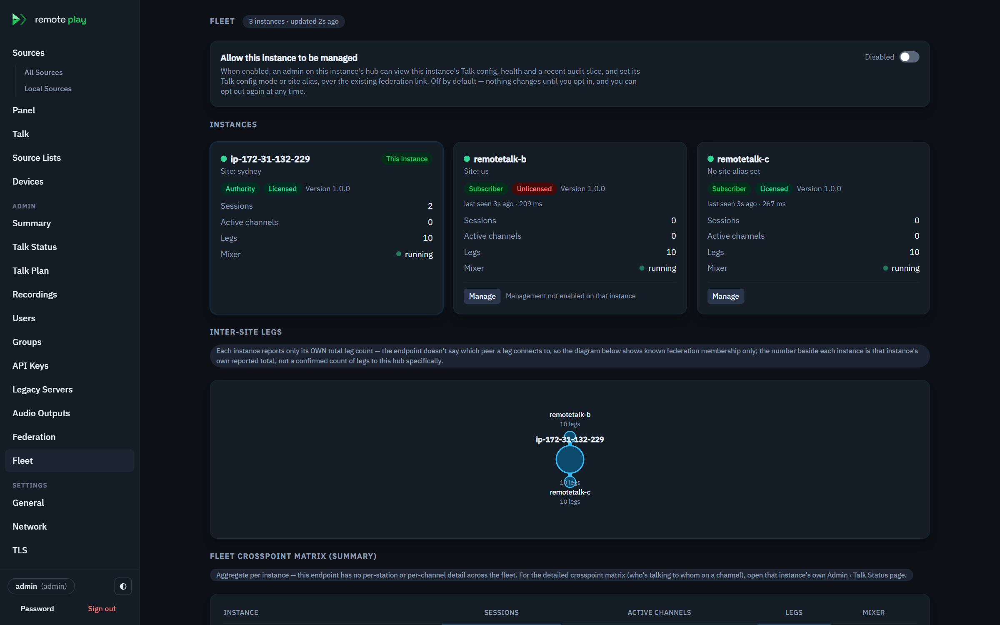

#### Driving another instance from the hub

An admin can also *drive* a member from the hub — **Manage** opens its Talk
config, health and a recent audit slice, and can set its config mode or site
alias. Three constraints keep this safe:

- It only works over the federation link, scoped and audited on both ends.
- The target must have opted in: **Allow this instance to be managed**, *"Off by
  default — nothing changes until you opt in, and you can opt out again at any
  time."* Otherwise the hub shows *"Management not enabled on that instance"*.
- Switching a member to subscriber from the hub carries the same destructive
  confirmation as doing it locally: *"On its next poll, every station, channel
  and panel profile there will be REPLACED by {authority}'s plan — nothing local
  is merged or kept."*

#### The portal

A station lives on one instance, so with several instances an operator needs
routing. The **portal** (a *"Session broker"*) is one URL: sign in once and it
allocates an instance by policy and redirects — *"Routing you to {instance} —
{reason}."* The rules run in strict order:

1. If your station is already live somewhere, it sends you **there** (*"your
   station is already active there"*) — which also stops the same station being
   live twice.
2. A one-instance fleet lands on the hub.
3. Otherwise it prefers the instance that **hosts your channels** — fewer legs.
4. Then the **least-busy** instance below a session ceiling.
5. If all are full, the hub.

Under shared single sign-on the redirect is silent; mobile clients use a
one-time, 60-second logon ticket. Identity is centrally managed, and disabling a
user *"immediately ends any of their live Talk sessions and blocks sign-in until
re-enabled."*

### Licensing

See [§8 Licence](#8-licence) for the general licence page. **Remote Talk** is one
of its gated features, and unlike the others it degrades to a timed audio preview
rather than disabling its pages outright — an unlicensed session gets a few
seconds and then closes with *"Remote Talk preview ended — a licence is required
to continue."*

Related features are licensed separately: **Channel recording** for the recorder,
**ExternalPanel** for wall panels, and **Federation** for shared plans and the
fleet.

One inconsistency worth knowing until it is tidied up: the **Talk Plan** admin
pages don't show the same "requires a licence" banner Federation and device
management show when unlicensed. An unlicensed admin can open the editors and
appear to save, and the server rejects the write. Treat a Talk Plan save that
silently fails on an unlicensed instance as this, not as a mistake in what you
typed.

### Known issues in this build

Open defects an operator can hit. Each is tracked; none is a mistake in your
configuration.

| Area | Behaviour | Ticket |
|---|---|---|
| **Key colour** | The talk pad doesn't show a key's configured colour, and an unset colour kills its talk fill, glow and tally ring. | RPC-250 |
| **Station access** | A restricted station becomes **open to anyone** when its assigned usernames don't resolve to local accounts — the fallback is "any authenticated user". Most likely on a subscriber whose authority named accounts that don't exist locally. Check Plan Sync's unresolved-assignment warnings after every plan change. | RPC-240 |
| **Cross-instance tally** | Tally between instances is **polled**, so an ordinary push-to-talk press does not light the far end in real time. A private line across sites carries audio correctly; only the far-end glow lags. | RPC-243, with RPC-244/245/246 in flight |
| **Wall panel PTT** | A push-to-talk device token can latch by simply never sending key-off — a **Push to talk** wall panel is not a hard guarantee against an open mic. Prefer **Listen only** anywhere unattended. | RPC-229 |
| **Inter-site media** | The audio leg between instances is cleartext RTP. Treat the inter-site path as trusted network, or tunnel it. | RPC-222 |
| **IFB dim** | Dim is currently per-channel, not dim-follows-key or per-member. | RPC-202 |

### Troubleshooting

| Symptom | Likely cause | What to check |
|---|---|---|
| Talk key never opens; mic never arms | The browser refused microphone access, or the page isn't a secure context | `getUserMedia` needs HTTPS (or `localhost`) — a plain `http://` console on the LAN won't even prompt. Check the address-bar permission icon; the client shows *"Microphone access was denied…"* if it was refused. |
| Station shows **Connecting…**/**Reconnecting…** indefinitely | A stalled WebSocket or ICE negotiation | Hard-refresh rather than re-pressing **Join** — the client retries up to 5 times before *"Connection lost after {count} attempts."*, and a fresh load restarts cleanly instead of retrying a wedged connection. |
| *"That station is already logged on elsewhere."* | The seat is live in another browser | Expected — one seat, one place. Use **Take over** in the picker if it is offered, or find the other session. |
| A key renders but never works | The station isn't allowed on that channel | The key lives on the profile; the right lives on the station. Check **Allowed channels** on that station. |
| Everyone can log on to a station you meant to restrict | **Assigned users** is empty, which means open | Empty is open, not closed. Add users or groups; the editor states the resulting posture back to you. |
| A station renders no keys at all | Its assigned profile was deleted | Look for the **Missing** badge. A broken explicit assignment does *not* fall through to the site default. |
| Restriction vanished after a plan sync | The authority named a user or group that doesn't exist here | The station falls back to "any authenticated user". Create the account or group locally, or check the unresolved-assignment warnings on Plan Sync. |
| A local conversation sounds laggy | The channel is homed at another site | Check **Homed on** — see [Homed on](#homed-on--where-the-audio-actually-mixes). |
| No audio from a channel you're listening to | No active talker, the key is muted, or the session isn't healthy | Confirm the listen half is lit and unmuted, then check **Talk Status**: the **Uplink** meter and the channel's **Buses** row show whether there is anyone to hear. |
| A kiosk talk key never lights up | Expected — kiosk keys are static | Use a [wall panel](#wall-panels) for a live wall display, or sign in at [/talk](#the-talk-client). |
| Talk cuts out after a few seconds | The instance isn't licensed for Remote Talk | **Settings › Licence** — see [Licensing](#licensing). |
| Fleet numbers look wrong | The dashboard may be showing mock data | Look for the *"Demo data…"* banner. |

---

## 10. Example configurations

Four worked plans. They are illustrative shapes, not products — the point is the
*reasoning*: which kind, who talks, who hears, and where it homes.

### Sports broadcast — a single OB truck

One venue, one truck, everybody within a hundred metres. The whole plan homes
**on this instance**; nothing should leave the compound.

| Channel | Kind | Talkers | Listen | Why |
|---|---|---|---|---|
| **PRODUCTION** | Party line | Director, PA, Vision, Replay, Graphics | Open | The main conversation. Everyone speaks. |
| **CAMERAS** | Group | Director, Vision | Open | Camera ops hear instruction and don't clutter it. Keeping cameras off the talk side is the entire point. |
| **TALENT IFB** | IFB | Director, Producer | — | Programme to the commentators, ducked when the director speaks. **Priority** above the producer's. |
| **RF/ENG** | Party line | RF tech, roving ops | Open | Off the main line so a radio problem doesn't block the director. |

Stations: **Director**, **PA**, **Vision**, **Replay**, **Graphics**, **Cameras
1–6**, **Commentary 1–2**, **RF**.

Panels: one profile per role family. The director's has PRODUCTION latching in
slot 0, CAMERAS **Momentary** with **No latch** (a stuck key here goes to a
camera op mid-shot), TALENT IFB momentary in red, and person keys to PA, Vision
and Replay. Camera ops get a small profile — CAMERAS listen-only, a person key to
Vision — and one profile serves all six seats.

Use the **Panel Builder** for the truck core (Director, PA, Vision, Replay,
Graphics) with **PRODUCTION** as a shared channel: five members, one action, each
gets four person keys plus the party line.

### Ballet — a lyric theatre

The distinguishing feature is that most of the crew must not *hear* chatter
during a performance; they take cues. Discipline over convenience.

| Channel | Kind | Talkers | Listen | Why |
|---|---|---|---|---|
| **DSM CALLS** | Group | DSM only | Open | The show is called on this and nothing else is allowed on it. |
| **STAGE** | Party line | Stage crew, ASMs | Open | Working conversation between scene changes. |
| **FLYS** | Party line | Flys, DSM | Open | Small, safety-critical, kept separate. |
| **LX/SOUND** | Party line | LX, Sound, DSM | Open | Departmental. |
| **CONDUCTOR IFB** | IFB | DSM | — | Pit relay, ducked for a call. |

Every key on **DSM CALLS** is **Momentary** with **No latch**, on every profile,
without exception. Set **Listen by default** on DSM CALLS for all crew — a
missed cue because somebody hadn't opened their listen key is not an acceptable
failure mode. Colour it red everywhere and put it in slot 0 on every profile, so
it is the same key in the same place whoever you are.

Give **FLYS** its own channel rather than folding it into STAGE. Under a flying
piece the conversation must not compete with a scene change.

### Olympics — multi-venue, one broadcast centre

Here homing stops being an academic setting. Say three venues (Aquatics, Athletics,
Arena) plus an IBC, each a Remote Play instance, federated, plan authority at the
IBC with each venue a **subscriber**.

| Channel | Kind | Homed on | Why |
|---|---|---|---|
| **AQUATICS PROD** | Party line | **Site: aquatics** | Twenty people at one venue. Homed locally, none of it crosses the WAN. |
| **ATHLETICS PROD** | Party line | **Site: athletics** | Same. |
| **ARENA PROD** | Party line | **Site: arena** | Same. |
| **IBC COORD** | Party line | **Cloud** (the IBC) | Genuinely cross-venue. Each venue exchanges one leg with the IBC regardless of headcount. |
| **ALL CALL** | Group | **Cloud** | Emergency/announcement. Talkers restricted to IBC duty managers, **Listener open**. |

Get this wrong — home **AQUATICS PROD** on the cloud — and every word between two
people standing next to each other at the pool makes a round trip to the IBC and
back. That is the single highest-value decision in a multi-venue plan.

Operational notes:

- Set a **Site alias** on each instance (`aquatics`, `athletics`, `arena`) before
  building channels, so homing can name them.
- Operators reach the fleet through the **portal**, not a venue URL — it routes
  them to the instance hosting their channels, and back to the right one if their
  station is already live.
- Watch for the plan-sync unresolved-assignment warnings: if a venue hasn't got a
  user account the IBC named, that station silently becomes open to everyone at
  that venue.
- Use **Groups** for access, not individual users. Rosters change daily; per-venue
  groups mean access follows the group.

### A parade — a moving route

Route-shaped rather than venue-shaped: positions along a few miles, a start, a
finish, a review stand, and connectivity that varies from good to appalling.

| Channel | Kind | Homed on | Why |
|---|---|---|---|
| **ROUTE COORD** | Party line | **Cloud** | Members are geographically spread with no natural centre. Cloud is the only fair home. |
| **REVIEW STAND** | Party line | **Site: stand** | A dense cluster of people in one place — home it with them. |
| **TALENT IFB** | IFB | **Cloud** | Presenters, ducked for the director. |
| **SAFETY** | Group | **Cloud** | Talkers restricted to safety leads, **Listener open** to everyone. High **Priority**. |

The things this shape specifically needs:

- **Wall panels** at fixed points — start marshalling, the stand, the dispersal
  area. Provision them **Listen only** where the public can reach them, **Push to
  talk** only where a marshal is stationed.
- **SAFETY** on **Momentary** with **No latch** on every profile, high
  **Priority** so it takes the ear over production chatter, red, slot 0.
- Expect reconnects. Positions on poor connectivity will drop and come back; the
  client retries and personal listen levels are restored on rejoin, so an
  operator who reconnects does not have to rebuild their mix.
- Keep **ROUTE COORD** membership small and push the detail down into
  position-local channels. A party line with sixty people on it is not a channel,
  it is a crowd.

---

## What this revision does not cover

These areas exist in the product and are reachable from the sidebar, but are
not yet documented here. They are the subject of the next revisions:

- **Devices** — Axia device management: LWRP terminal, configuration backup and
  restore, scheduled backup tasks, firmware banks.
- **Federation** and **Legacy Servers** — aggregating sources from peer
  RemotePlay servers and from legacy RemotePlay installations. (Remote Talk's
  own use of the federation link — shared plans, homing, the Fleet dashboard and
  the portal — is covered in §9
  [The fleet](#the-fleet-instances-homing-and-the-portal) and, in depth, in
  [remote-talk.html](remote-talk.html).)
- **Summary** and **Users** — the admin overview and account management.
- **Panel control** — issuing `pt_` panel tokens for external controllers.
- The REST API and WebSocket streaming contract.

**API Keys** and **Settings › Backups** are placeholders in this build and say
so in the UI; there is nothing to document yet.

---

*Generated against main @ `f0587ab`, RPC-1…RPC-250 (the Remote Talk epic RPC-126
through the production-first station picker, RPC-249). The Remote Talk chapter is
the operator-and-admin walkthrough; the full engineering reference is
[remote-talk.html](remote-talk.html) in this folder. Console screenshots captured
with `build/manual-screenshots.mjs` against a local instance fed by
`RemotePlayCore.LivewireSim` and `RemotePlayCore.Aes67Sim`; the Remote Talk
screenshots (25–38) with `build/manual-screenshots-talk.mjs` against the live
`a.remote.talk` fleet, which carries a seeded plan and needs no simulators. See
[manual-maintenance.md](../manual-maintenance.md).*
